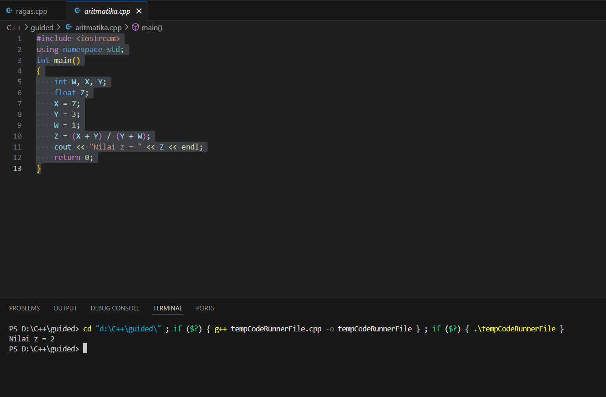

# <h1 align="center">Laporan Praktikum Modul 1 <br> PENGENALAN C++ </h1>
<p align="center">Dahragassya Safnas Adiyata - 103112430146</p>

## Dasar Teori

C++ adalah bahasa pemrograman tingkat menengah yang dikembangkan oleh Bjarne Stroustrup di Bell Labs pada awal 1980-an, sebagai evolusi dari bahasa C (yang awalnya dibuat oleh Dennis Ritchie untuk sistem Unix). C++ dibangun untuk mempertahankan efisiensi dan dukungan pemrograman tingkat rendah (low level coding) dari C, namun dengan penambahan konsep-konsep baru. Perbedaan paling mendasar adalah dukungan penuh C++ terhadap Pemrograman Berorientasi Objek (OOP), memperkenalkan fitur seperti class, inheritance, dan overloading.

## Guided

### soal 1 (Aritmatika)
    #include <iostream>
    using namespace std;
    int main()
    {
    int W, X, Y;
    float Z;
    X = 7;
    Y = 3;
    W = 1;
    Z = (X + Y) / (Y + W);
    cout << "Nilai z = " << Z << endl;
    return 0;
    }

Kode C++ di atas adalah program sederhana yang menghitung nilai variabel Z. Program pertama-tama mendeklarasikan tiga variabel integer (W, X, Y) dan satu variabel floating-point (Z). Variabel X diinisialisasi dengan nilai 7, Y dengan 3, dan W dengan 1. Perhitungan nilai Z menggunakan rumus (X + Y) / (Y + W), yang secara matematis adalah (7+3)/(3+1) atau 10/4. Karena semua operan dalam perhitungan ini adalah integer (X, Y, W), operasi 10/4 akan menghasilkan pembagian integer, yang hasilnya adalah 2 (sisa 2 diabaikan), dan hasil integer 2 ini kemudian diubah (cast) menjadi float saat disimpan di variabel Z. Akhirnya, program mencetak pesan "Nilai z = " diikuti nilai 2.00 (atau 2) ke konsol.

> Output
> 


### soal 2 (fungsi)


    #include <iostream>
    using namespace std;

    // Prosedur: hanya menampilkan hasil, tidak mengembalikan nilai
    void tampilkanHasil(double p, double l)
    {
    cout << "\n=== Hasil Perhitungan ===" << endl;
    cout << "Panjang : " << p << endl;
    cout << "Lebar   : " << l << endl;
    cout << "Luas    : " << p * l << endl;
    cout << "Keliling: " << 2 * (p + l) << endl;
    }

    // Fungsi: mengembalikan nilai luas
    double hitungLuas(double p, double l)
    {    
    return p * l;
    }

    // Fungsi: mengembalikan nilai keliling
    double hitungKeliling(double p, double l)
    {
    return 2 * (p + l);
    }

    int main()
    {
    double panjang, lebar;

    cout << "Masukkan panjang: ";
    cin >> panjang;
    cout << "Masukkan lebar  : ";
    cin >> lebar;

    // Panggil fungsi
    double luas = hitungLuas(panjang, lebar);
    double keliling = hitungKeliling(panjang, lebar);

    cout << "\nDihitung dengan fungsi:" << endl;
    cout << "Luas      = " << luas << endl;
    cout << "Keliling  = " << keliling << endl;

    // Panggil prosedur
    tampilkanHasil(panjang, lebar);

    return 0;
    }

Kode C++ diatas secara modular menghitung dan menampilkan luas serta keliling persegi panjang. Program diawali dengan meminta panjang dan lebar dari pengguna. Logika perhitungan dipecah menjadi dua fungsi terpisah (hitungLuas dan hitungKeliling) yang mengembalikan nilai double untuk digunakan kembali di main(). Selain itu, terdapat satu prosedur (tampilkanHasil, bertipe void) yang tidak mengembalikan nilai tetapi bertanggung jawab langsung untuk menerima data dan mencetak semua hasil perhitungan sekaligus ke konsol, mendemonstrasikan kedua pendekatan dalam membagi tugas pemrograman.

> Output
> 


### soal 3 (Kondisi)

```c++
#include <iostream>
using namespace std;
// int main()
// {
//     double tot_pembelian, diskon;
//     cout << "total pembelian: Rp";
//     cin >> tot_pembelian;
//     diskon = 0;
//     if (tot_pembelian >= 100000)
//         diskon = 0.05 * tot_pembelian;
//     cout << "besar diskon = Rp" << diskon;
// }


// int main()
// {
//     double tot_pembelian, diskon;
//     cout << "total pembelian: Rp";
//     cin >> tot_pembelian;
//     diskon = 0;
//     if (tot_pembelian >= 100000)
//         diskon = 0.05 * tot_pembelian;
//     else
//         diskon = 0;
//     cout << "besar diskon = Rp" << diskon;
// }


int main()
{
    int kode_hari;
    cout << "Menentukan hari kerja/libur\n"<<endl;
    cout << "1=Senin 3=Rabu 5=Jumat 7=Minggu "<<endl;
    cout << "2=Selasa 4=Kamis 6=Sabtu "<<endl;
    cin >> kode_hari;
    switch (kode_hari)
    {
    case 1:
    case 2:
    case 3:
    case 4:
    case 5:
        cout<<"Hari Kerja";
        break;
    case 6:
    case 7:
        cout<<"Hari Libur";
        break;
    default:
        cout<<"Kode masukan salah!!!";
    }
    return 0;
}
```

Kode c++ diatas aktif menjalankan program menggunakan struktur kendali switch untuk mengidentifikasi apakah sebuah kode angka hari merupakan Hari Kerja atau Hari Libur. Program pertama meminta pengguna memasukkan sebuah bilangan bulat (kode_hari) setelah menampilkan panduan kode hari 1 hingga 7. Nilai input tersebut kemudian diuji oleh pernyataan switch. Kasus 1 hingga 5 (Senin sampai Jumat) dikelompokkan bersama (fall-through karena tidak ada break di antara mereka) dan menghasilkan output "Hari Kerja". Kasus 6 dan 7 (Sabtu dan Minggu) juga dikelompokkan dan menghasilkan "Hari Libur". Blok default berfungsi sebagai penanganan kesalahan, mencetak pesan "Kode masukan salah!!!" jika pengguna memasukkan angka di luar rentang 1 hingga 7.

> Output
> 


### soal 4 (Perulangan)

```c++
#include <iostream>
using namespace std;
// int main()
// {
//     int jum;
//     cout << "jumlah perulangan: ";
//     cin >> jum;
//     for (int i = 0; i < jum; i++)
//     {
//         cout << "saya sahroni\n";
//     }
//     return 1;
// }


// while
int main()
{
    int i = 1;
    int jum;
    cin >> jum;
    do
    {
        cout << "bahlil ke-" << (i + 1) << endl;
        i++;
    } while (i < jum);
    return 0;
}
```
Kode C++ diatas aktif menjalankan program ini mendemonstrasikan struktur perulangan do-while untuk mencetak pesan berulang kali. Program dimulai dengan menginisialisasi variabel kontrol i menjadi 1 dan meminta pengguna memasukkan batas perulangan (jum). Perulangan do-while memiliki jaminan untuk dieksekusi minimal satu kali sebelum kondisinya diperiksa. Dalam setiap iterasi, program mencetak pesan "bahlil ke-" diikuti nilai i + 1, dan kemudian nilai i dinaikkan satu per satu (i++). Proses perulangan ini akan terus berlanjut selama kondisi i < jum masih bernilai benar, berhenti ketika i sudah mencapai atau melebihi batas yang ditentukan oleh pengguna.

> Output
> 


### soal 5 (Struct)
```c++
#include <iostream>
#include <string>
using namespace std;

// Definisi struct
struct Mahasiswa {
    string nama;
    string nim;
    float ipk;
};

int main() {

    Mahasiswa mhs1;

    cout << "Masukkan Nama Mahasiswa: ";
    getline(cin, mhs1.nama);
    // cin >> mhs1.nama;
    cout << "Masukkan NIM Mahasiswa : ";
    cin >> mhs1.nim;
    cout << "Masukkan IPK Mahasiswa : ";
    cin >> mhs1.ipk;

    cout << "\n=== Data Mahasiswa ===" << endl;
    cout << "Nama : " << mhs1.nama << endl;
    cout << "NIM  : " << mhs1.nim << endl;
    cout << "IPK  : " << mhs1.ipk << endl;

    return 0;
}
```

Kode C++ di atas mendemonstrasikan penggunaan struct (struktur) untuk mengelompokkan data yang saling berkaitan, dalam hal ini data seorang mahasiswa. Awalnya, struktur bernama Mahasiswa didefinisikan untuk menampung tiga tipe data: string nama, string nim, dan float ipk. Dalam fungsi main(), sebuah variabel struktur bernama mhs1 dideklarasikan dari tipe Mahasiswa. Program kemudian meminta pengguna untuk memasukkan data: nama, NIM, dan IPK, dan menyimpannya ke anggota struktur menggunakan operator titik (misalnya, mhs1.nama). Perlu diperhatikan, untuk input nama digunakan getline(cin, ...) agar nama yang mengandung spasi dapat dimasukkan sepenuhnya. Terakhir, program mencetak semua data yang telah disimpan (Nama, NIM, dan IPK) ke konsol, mengonfirmasi bahwa data telah berhasil dikelompokkan dan diakses melalui variabel mhs1.

> Output
> 

### soal 6 (Test)
```c++
#include <iostream>
using namespace std;
int main()
{
    string ch;
    cout << "Masukkan sebuah karakter: ";
    // cin >> ch;
    ch = getchar();  //Menggunakan getchar() untuk membaca satu karakter
    cout << "Karakter yang Anda masukkan adalah: " << ch << endl;
    return 0;
}
```
Kode C++ diatas berfungsi untuk menerima dan menampilkan satu karakter dari input pengguna. Meskipun variabel ch dideklarasikan sebagai string, program ini secara khusus menggunakan fungsi getchar() untuk membaca input. getchar() adalah fungsi dari library C (<cstdio> atau <stdio.h>) yang diakses melalui C++ dan dirancang untuk membaca satu karakter dari input standar (stdin). Karakter yang dibaca oleh getchar() dikembalikan sebagai nilai integer (kode ASCII), yang kemudian secara implisit diubah menjadi string saat diberikan ke variabel ch. Akhirnya, program mencetak pesan yang mengonfirmasi karakter tunggal yang berhasil di-input oleh pengguna

> Output
> 

## Unguided

### Soal 1

```c++
#include <iostream>
#include <iomanip> 

using namespace std;

int main() {
    float bilangan1, bilangan2;

    cout << "Masukkan bilangan pertama (float): ";
    cin >> bilangan1;

    cout << "Masukkan bilangan kedua (float): ";
    cin >> bilangan2;

    cout << "\n--- Hasil Operasi Aritmatika ---" << endl;
    
    cout << fixed << setprecision(2); 

    cout << "Penjumlahan: " << bilangan1 + bilangan2 << endl;

    cout << "Pengurangan: " << bilangan1 - bilangan2 << endl;

    cout << "Perkalian: " << bilangan1 * bilangan2 << endl;

    if (bilangan2 != 0) {
        cout << "Pembagian: " << bilangan1 / bilangan2 << endl;
    } else {
        cout << "Pembagian: Tidak dapat dilakukan (Pembagian dengan Nol)" << endl;
    }
    
    return 0;
}
```
>

Program diatas dibuat untuk menjalankan empat operasi aritmatika dasar pada dua bilangan float yang diinput. Setelah mendeklarasikan dan menerima kedua input, program menggunakan std::setprecision untuk memformat semua hasil desimal menjadi dua angka di belakang koma. Hasil penjumlahan, pengurangan, dan perkalian dicetak langsung. Yang terpenting, operasi pembagian dienkapsulasi dalam pengecekan if-else; ini berfungsi sebagai mekanisme keamanan untuk mencegah error pembagian dengan nol, memastikan program tetap stabil dan memberikan feedback yang sesuai jika pembilang bernilai nol

> Output
> 


### Soal 2

soal nomor 2

```c++
#include <iostream>
#include <string>
#include <vector>

using namespace std;

const vector<string> satuan_belasan = {
    "nol", "satu", "dua", "tiga", "empat", "lima", "enam", "tujuh", "delapan", "sembilan",
    "sepuluh", "sebelas", "dua belas", "tiga belas", "empat belas", "lima belas", 
    "enam belas", "tujuh belas", "delapan belas", "sembilan belas"
};

const vector<string> puluhan_text = {
    "", "", "dua puluh", "tiga puluh", "empat puluh", "lima puluh", 
    "enam puluh", "tujuh puluh", "delapan puluh", "sembilan puluh"
};

string angkaKeTulisanSederhana(int n) {
    if (n < 0 || n > 100) {
        return "Angka di luar rentang.";
    }
    
    if (n < 20) {
        return satuan_belasan[n];
    } 
    else if (n < 100) {
        int puluhan = n / 10;
        int satuan = n % 10;
        
        string hasil = puluhan_text[puluhan]; 

        if (satuan != 0) {
            hasil += " " + satuan_belasan[satuan];
        }

        return hasil;
    } 
    else {
        return "seratus";
    }
}

int main() {
    int n;

    cout << "Masukkan bilangan (0 s.d 100): ";
    if (!(cin >> n)) {
        cerr << "Input tidak valid." << endl;
        return 1;
    }

    string hasil = angkaKeTulisanSederhana(n);

    cout << "\n" << n << " : " << hasil << endl;
    cout << "(Contoh: 79 : tujuh puluh sembilan)" << endl;

    return 0;
}
```

Program diatas berfungsi sebagai konverter bilangan bulat positif dalam rentang 0 hingga 100 menjadi representasi teksnya dalam Bahasa Indonesia. Inti dari program ini adalah menggunakan dua vector konstan sebagai kamus kata (satuan_belasan dan puluhan_text) untuk memetakan angka ke tulisannya. Logika program memanfaatkan struktur kondisional (if-else): untuk angka di bawah 20, hasilnya langsung diambil dari indeks vector satuan_belasan; sedangkan untuk angka antara 20 hingga 99, program memecahnya menjadi bagian puluhan (menggunakan pembagian) dan bagian satuan (menggunakan modulo) untuk kemudian menggabungkannya menjadi teks yang benar, misalnya mengubah 79 menjadi "tujuh puluh sembilan," sementara angka 100 ditangani sebagai kasus khusus.
Kalau adalanjutan di lanjut disini aja

> Output
> 


### Soal 3

```c++
#include <iostream>
#include <string>

using namespace std;

void cetakPolaMirrorBaru(int N) {
    if (N <= 0) {
        cout << "Input harus bilangan bulat positif." << endl;
        return;
    }

    for (int i = N; i >= 1; --i) {
        
        for (int s = 0; s < N - i; ++s) {
            cout << " ";
        }

        for (int j = i; j >= 1; --j) {
            cout << j;
            if (j > 1) {
                cout << " "; 
            }
        }
        
        cout << " * "; 

        for (int k = 1; k <= i; ++k) {
            cout << k;
            if (k < i) {
                cout << " "; 
            }
        }

        cout << endl; 
    }
    
    for (int s = 0; s < N; ++s) {
        cout << " ";
    }
    cout << "*" << endl;
}

int main() {
    int inputN;

    cout << "Masukkan bilangan bulat untuk pola (N): ";
    if (!(cin >> inputN)) {
        cerr << "Input tidak valid. Harap masukkan angka." << endl;
        return 1;
    }

    cout << "\nOutput:\n";

    cetakPolaMirrorBaru(inputN);

    return 0;
}
```


Program diatas menghasilkan pola angka mirror bertingkat berdasarkan input N. Pola dibuat menggunakan perulangan bersarang (nested loops) yang berjalan dari N hingga 1. Di setiap baris, loop mencetak spasi indentasi yang bertambah, diikuti angka yang menurun (sisi kiri) dan kemudian menaikt (sisi kanan). Stabilitas program bergantung pada pemosisian yang tepat dari angka, pemisah (*), dan pengecekan kondisi untuk mencegah karakter tambahan, sehingga pola simetrisnya dapat terbentuk dengan akurat.

> Output
> 


## Referensi

1. https://en.wikipedia.org/wiki/Data_structure (diakses blablabla)
