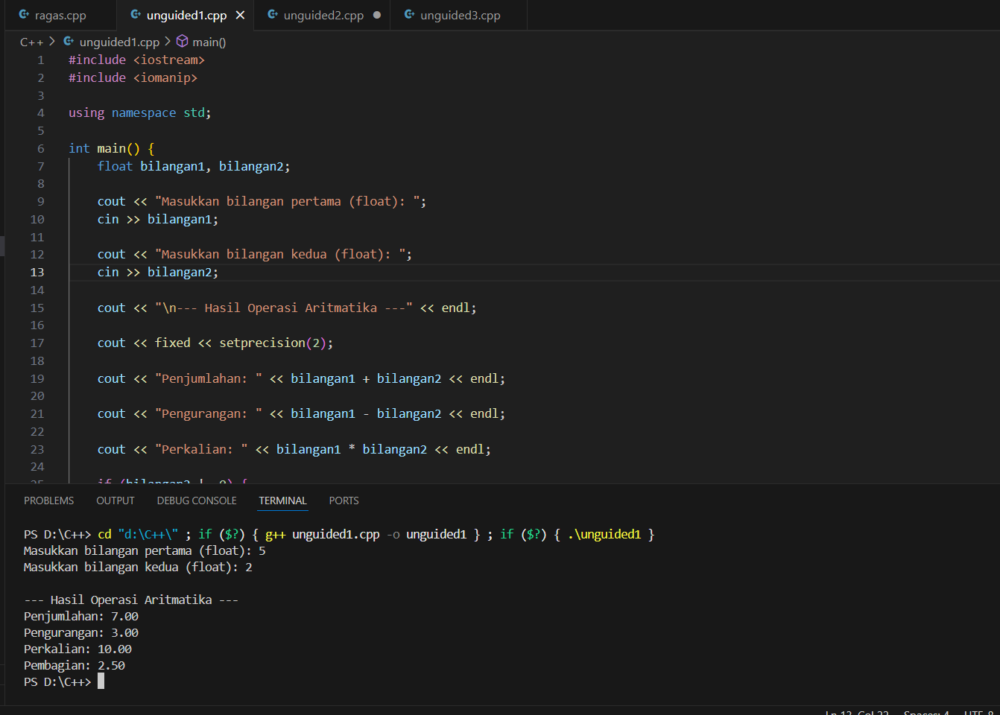
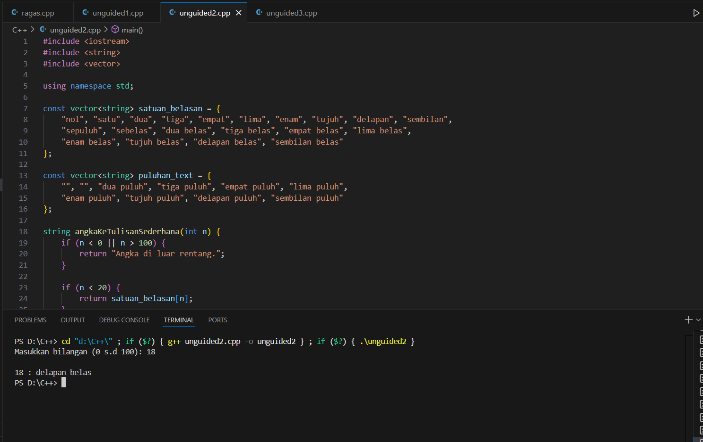
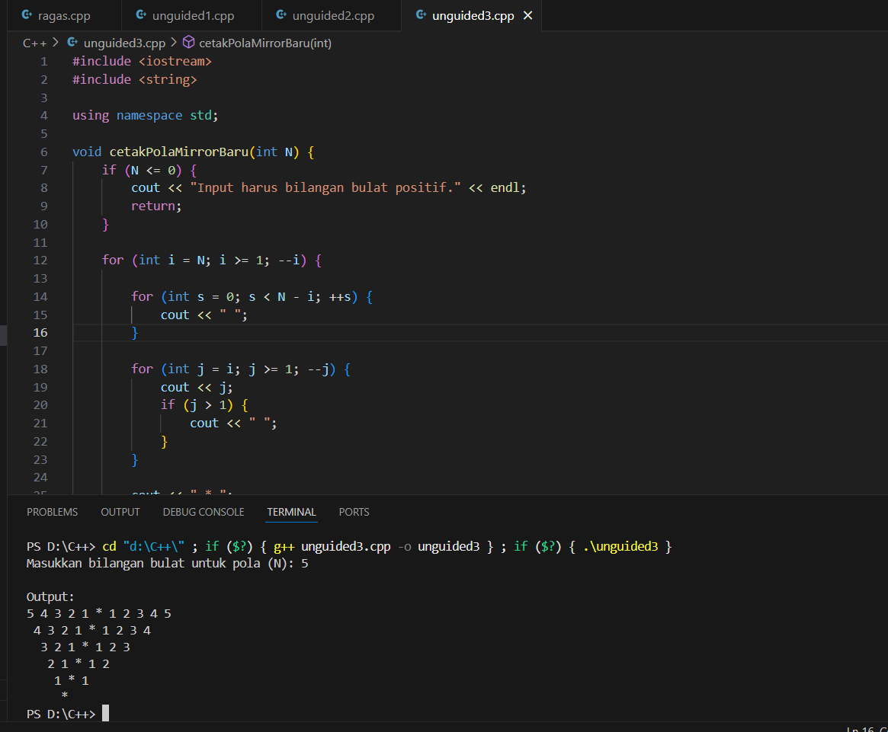

# <h1 align="center">Laporan Praktikum Modul 1 <br> PENGENALAN C++ </h1>
<p align="center">Dahragassya Safnas Adiyata - 103112430146</p>

## Dasar Teori

C++ adalah bahasa pemrograman tingkat menengah yang dikembangkan oleh Bjarne Stroustrup di Bell Labs pada awal 1980-an, sebagai evolusi dari bahasa C (yang awalnya dibuat oleh Dennis Ritchie untuk sistem Unix). C++ dibangun untuk mempertahankan efisiensi dan dukungan pemrograman tingkat rendah (low level coding) dari C, namun dengan penambahan konsep-konsep baru. Perbedaan paling mendasar adalah dukungan penuh C++ terhadap Pemrograman Berorientasi Objek (OOP), memperkenalkan fitur seperti class, inheritance, dan overloading.

## Guided

### soal 1

aku mengerjakan perulangan

## Unguided

### Soal 1

```c++
#include <iostream>
#include <iomanip> 

using namespace std;

int main() {
    float bilangan1, bilangan2;

    cout << "Masukkan bilangan pertama (float): ";
    cin >> bilangan1;

    cout << "Masukkan bilangan kedua (float): ";
    cin >> bilangan2;

    cout << "\n--- Hasil Operasi Aritmatika ---" << endl;
    
    cout << fixed << setprecision(2); 

    cout << "Penjumlahan: " << bilangan1 + bilangan2 << endl;

    cout << "Pengurangan: " << bilangan1 - bilangan2 << endl;

    cout << "Perkalian: " << bilangan1 * bilangan2 << endl;

    if (bilangan2 != 0) {
        cout << "Pembagian: " << bilangan1 / bilangan2 << endl;
    } else {
        cout << "Pembagian: Tidak dapat dilakukan (Pembagian dengan Nol)" << endl;
    }
    
    return 0;
}
```
>

Program diatas dibuat untuk menjalankan empat operasi aritmatika dasar pada dua bilangan float yang diinput. Setelah mendeklarasikan dan menerima kedua input, program menggunakan std::setprecision untuk memformat semua hasil desimal menjadi dua angka di belakang koma. Hasil penjumlahan, pengurangan, dan perkalian dicetak langsung. Yang terpenting, operasi pembagian dienkapsulasi dalam pengecekan if-else; ini berfungsi sebagai mekanisme keamanan untuk mencegah error pembagian dengan nol, memastikan program tetap stabil dan memberikan feedback yang sesuai jika pembilang bernilai nol

> Output
> 


### Soal 2

soal nomor 2

```c++
#include <iostream>
#include <string>
#include <vector>

using namespace std;

const vector<string> satuan_belasan = {
    "nol", "satu", "dua", "tiga", "empat", "lima", "enam", "tujuh", "delapan", "sembilan",
    "sepuluh", "sebelas", "dua belas", "tiga belas", "empat belas", "lima belas", 
    "enam belas", "tujuh belas", "delapan belas", "sembilan belas"
};

const vector<string> puluhan_text = {
    "", "", "dua puluh", "tiga puluh", "empat puluh", "lima puluh", 
    "enam puluh", "tujuh puluh", "delapan puluh", "sembilan puluh"
};

string angkaKeTulisanSederhana(int n) {
    if (n < 0 || n > 100) {
        return "Angka di luar rentang.";
    }
    
    if (n < 20) {
        return satuan_belasan[n];
    } 
    else if (n < 100) {
        int puluhan = n / 10;
        int satuan = n % 10;
        
        string hasil = puluhan_text[puluhan]; 

        if (satuan != 0) {
            hasil += " " + satuan_belasan[satuan];
        }

        return hasil;
    } 
    else {
        return "seratus";
    }
}

int main() {
    int n;

    cout << "Masukkan bilangan (0 s.d 100): ";
    if (!(cin >> n)) {
        cerr << "Input tidak valid." << endl;
        return 1;
    }

    string hasil = angkaKeTulisanSederhana(n);

    cout << "\n" << n << " : " << hasil << endl;
    cout << "(Contoh: 79 : tujuh puluh sembilan)" << endl;

    return 0;
}
```

Program diatas berfungsi sebagai konverter bilangan bulat positif dalam rentang 0 hingga 100 menjadi representasi teksnya dalam Bahasa Indonesia. Inti dari program ini adalah menggunakan dua vector konstan sebagai kamus kata (satuan_belasan dan puluhan_text) untuk memetakan angka ke tulisannya. Logika program memanfaatkan struktur kondisional (if-else): untuk angka di bawah 20, hasilnya langsung diambil dari indeks vector satuan_belasan; sedangkan untuk angka antara 20 hingga 99, program memecahnya menjadi bagian puluhan (menggunakan pembagian) dan bagian satuan (menggunakan modulo) untuk kemudian menggabungkannya menjadi teks yang benar, misalnya mengubah 79 menjadi "tujuh puluh sembilan," sementara angka 100 ditangani sebagai kasus khusus.
Kalau adalanjutan di lanjut disini aja

> Output
> 


### Soal 3

```c++
#include <iostream>
#include <string>

using namespace std;

void cetakPolaMirrorBaru(int N) {
    if (N <= 0) {
        cout << "Input harus bilangan bulat positif." << endl;
        return;
    }

    for (int i = N; i >= 1; --i) {
        
        for (int s = 0; s < N - i; ++s) {
            cout << " ";
        }

        for (int j = i; j >= 1; --j) {
            cout << j;
            if (j > 1) {
                cout << " "; 
            }
        }
        
        cout << " * "; 

        for (int k = 1; k <= i; ++k) {
            cout << k;
            if (k < i) {
                cout << " "; 
            }
        }

        cout << endl; 
    }
    
    for (int s = 0; s < N; ++s) {
        cout << " ";
    }
    cout << "*" << endl;
}

int main() {
    int inputN;

    cout << "Masukkan bilangan bulat untuk pola (N): ";
    if (!(cin >> inputN)) {
        cerr << "Input tidak valid. Harap masukkan angka." << endl;
        return 1;
    }

    cout << "\nOutput:\n";

    cetakPolaMirrorBaru(inputN);

    return 0;
}
```


Program diatas menghasilkan pola angka mirror bertingkat berdasarkan input N. Pola dibuat menggunakan perulangan bersarang (nested loops) yang berjalan dari N hingga 1. Di setiap baris, loop mencetak spasi indentasi yang bertambah, diikuti angka yang menurun (sisi kiri) dan kemudian menaikt (sisi kanan). Stabilitas program bergantung pada pemosisian yang tepat dari angka, pemisah (*), dan pengecekan kondisi untuk mencegah karakter tambahan, sehingga pola simetrisnya dapat terbentuk dengan akurat.

> Output
> 


## Referensi

1. https://en.wikipedia.org/wiki/Data_structure (diakses blablabla)
