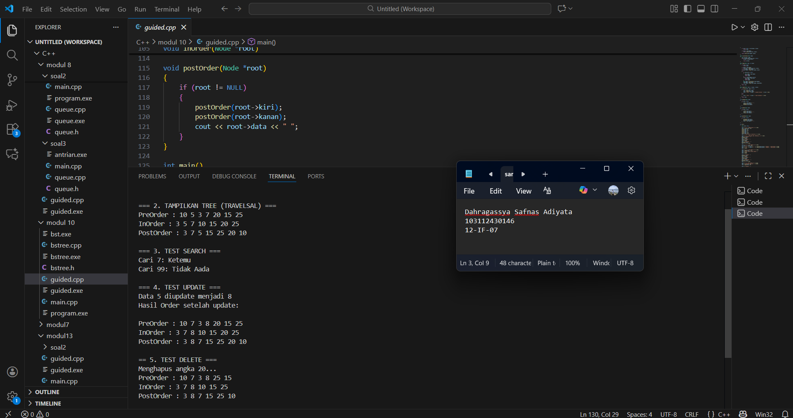

# <h1 align="center">Laporan Praktikum Modul 10 TREE <br> Stack</h1>
<p align="center">Dahragassya Safnas Adiyata - 103112430146</p>

## Dasar Teori
Tree merupakan struktur data non-linear yang digunakan untuk merepresentasikan hubungan hierarkis antar data menggunakan node (simpul) dan pointer. Setiap node pada tree menyimpan sebuah data dan memiliki satu atau lebih pointer yang menunjuk ke node anak (child). Node paling atas disebut root, sedangkan node yang tidak memiliki child disebut leaf. Struktur tree banyak digunakan dalam pemrograman C++ karena bahasa ini mendukung pengelolaan memori secara dinamis menggunakan pointer, sehingga cocok untuk membangun struktur data bercabang.

## Guide

```go
#include <iostream>
using namespace std;

struct Node
{
    int data;
    Node *kiri, *kanan;
};

Node *buatNode(int nilai)
{
    Node *baru = new Node();
    baru->data = nilai;
    baru->kiri = baru->kanan = NULL;
    return baru;
}

Node *insert(Node *root, int nilai)
{
    if (root == NULL)
        return buatNode(nilai);
    
    if (nilai < root->data)
        root->kiri = insert(root->kiri, nilai);
    else if (nilai > root->data)
        root->kanan = insert(root->kanan, nilai);

    return root;
}

Node *search(Node *root, int nilai)
{
    if (root == NULL || root->data == nilai)
        return root;

    if (nilai < root->data)
        return search(root->kiri, nilai);

    return search(root->kanan, nilai);
}

Node *nilaiTerkecil(Node *node)
{
    Node *current = node;
    while (current && current->kiri != NULL)
        current = current->kiri;

        return current;
}

Node *hapus(Node *root, int nilai)
{
    if (root == NULL)
        return root;

    if (nilai < root->data)
        root->kiri = hapus(root->kiri, nilai);
    else if (nilai > root->data)
        root->kanan = hapus(root->kanan, nilai);
    else
    {
        if (root->kiri == NULL)
        {
            Node *temp = root->kanan;
            delete root;
            return temp;
        }
        else if (root->kanan == NULL){
            Node *temp = root->kiri;
            delete root;
            return temp;
        }
        Node *temp = nilaiTerkecil(root->kanan);
        root->data = temp->data;
        root->kanan = hapus(root->kanan, temp->data);
    }
    return root;
}

Node *update(Node *root, int Lama, int baru)
{
    if (search(root, Lama) != NULL)
    {
        root = hapus(root, Lama);
        root = insert(root, baru);
        cout << "Data " << Lama << " diupdate menjadi " << baru << endl;
    }
    else
    {
        cout << "Data " << Lama << " tidak ditemukan!" << endl;
    }
    return root;
}

void preOrder(Node *root)
{
    if (root != NULL)
    {
        cout << root->data << " ";
        preOrder(root->kiri);
        preOrder(root->kanan);
    }
}

void inOrder(Node *root)
{
    if (root != NULL)
    {
        inOrder(root->kiri);
        cout << root->data << " ";
        inOrder(root->kanan);
    }
}

void postOrder(Node *root)
{
    if (root != NULL)
    {
        postOrder(root->kiri);
        postOrder(root->kanan);
        cout << root->data << " ";
    }
}

int main()
{
    Node *root = NULL;

    cout << "=== 1. INSERT DATA ===" << endl;
    root = insert(root, 10);
    insert(root, 5);
    insert(root, 20);
    insert(root, 3);
    insert(root, 7);
    insert(root, 15);
    insert(root, 25);
    cout << "Data berhasil dimasukan.\n" << endl;

    cout << "=== 2. TAMPILKAN TREE (TRAVELSAL) ===" << endl;
    cout << "PreOrder : ";
    preOrder(root);
    cout << endl;
    cout << "InOrder : ";
    inOrder(root);
    cout << endl;
    cout << "PostOrder : ";
    postOrder(root);
    cout << "\n" << endl;

    cout << "=== 3. TEST SEARCH ===" << endl;
    int cari1 = 7, cari2 = 99;
    cout << "Cari " << cari1 << ": " << (search(root,cari1) ? "Ketemu" : "Tidak Aada") << endl;
    cout << "Cari " << cari2 << ": " << (search(root,cari2) ? "Ketemu" : "Tidak Aada") << endl;
    cout << endl;

    cout << "=== 4. TEST UPDATE ===" << endl;
    root = update(root, 5, 8);
    cout << "Hasil Order setelah update: ";
    cout << endl;
    cout << endl;

    cout << "PreOrder : ";
    preOrder(root);
    cout << endl;
    cout << "InOrder : ";
    inOrder(root);
    cout << endl;
    cout << "PostOrder : ";
    postOrder(root);
    cout << "\n" << endl;

    cout << "== 5. TEST DELETE ===" << endl;
    cout << "Menghapus angka 20..." << endl;
    root = hapus(root, 20);

    cout << "PreOrder : ";
    preOrder(root);
    cout << endl;
    cout << "InOrder : ";
    inOrder(root);
    cout << endl;
    cout << "PostOrder : ";
    postOrder(root);
    cout << "\n" << endl;

    return 0;
}
```
> Output 
> 
> 

## UNGUIDED

#### bstree.h
```c++
#ifndef BSTREE_H
#define BSTREE_H

#include <iostream>
using namespace std;


typedef struct Node {
    int data;
    Node* kiri;
    Node* kanan;
} Node;

Node* buatNode(int x);
void insertBST(Node* &akar, int x);

void inorder(Node* akar);
void preorder(Node* akar);
void postorder(Node* akar);

int jumlahNode(Node* akar);
int totalNilai(Node* akar);
int tinggiPohon(Node* akar);

#endif
```
#### bstree.cpp
```c++
#include "bstree.h"

Node* buatNode(int x) {
    Node* baru = new Node;
    baru->data = x;
    baru->kiri = NULL;
    baru->kanan = NULL;
    return baru;
}

void insertBST(Node* &akar, int x) {
    if (akar == NULL) {
        akar = buatNode(x);
    } else if (x < akar->data) {
        insertBST(akar->kiri, x);
    } else if (x > akar->data) {
        insertBST(akar->kanan, x);
    }
}

void inorder(Node* akar) {
    if (akar != NULL) {
        inorder(akar->kiri);
        cout << akar->data << " ";
        inorder(akar->kanan);
    }
}

void preorder(Node* akar) {
    if (akar != NULL) {
        cout << akar->data << " ";
        preorder(akar->kiri);
        preorder(akar->kanan);
    }
}

void postorder(Node* akar) {
    if (akar != NULL) {
        postorder(akar->kiri);
        postorder(akar->kanan);
        cout << akar->data << " ";
    }
}

int jumlahNode(Node* akar) {
    if (akar == NULL)
        return 0;
    return 1 + jumlahNode(akar->kiri) + jumlahNode(akar->kanan);
}

int totalNilai(Node* akar) {
    if (akar == NULL)
        return 0;
    return akar->data + totalNilai(akar->kiri) + totalNilai(akar->kanan);
}

int tinggiPohon(Node* akar) {
    if (akar == NULL)
        return 0;

    int kiri = tinggiPohon(akar->kiri);
    int kanan = tinggiPohon(akar->kanan);

    return (kiri > kanan) ? kiri + 1 : kanan + 1;
}
```
#### main.cpp
```c++
#include <iostream>
#include "bstree.h"
using namespace std;

int main() {
    Node* akar = NULL;

    /* Input data ke BST */
    insertBST(akar, 1);
    insertBST(akar, 2);
    insertBST(akar, 6);
    insertBST(akar, 4);
    insertBST(akar, 5);
    insertBST(akar, 3);
    insertBST(akar, 6); 
    insertBST(akar, 7);

    cout << "=== HASIL SOAL 1 ===" << endl;
    inorder(akar);
    cout << endl;

    cout << "\n=== HASIL SOAL 2 ===" << endl;
    inorder(akar);
    cout << endl;
    cout << "Tinggi Pohon   : " << tinggiPohon(akar) << endl;
    cout << "Jumlah Node    : " << jumlahNode(akar) << endl;
    cout << "Total Nilai    : " << totalNilai(akar) << endl;

    cout << "\n=== HASIL SOAL 3 ===" << endl;
    cout << "Preorder   : ";
    preorder(akar);
    cout << endl;

    cout << "Postorder  : ";
    postorder(akar);
    cout << endl;

    return 0;
}
```
> Output soal 1,2,3
> 
> 

Program ini dirancang untuk membangun dan mengelola struktur data Binary Search Tree (BST) menggunakan bahasa pemrograman C++ dengan pendekatan linked list dan alokasi memori dinamis. Setiap elemen dalam BST direpresentasikan sebagai sebuah node yang menyimpan satu data bertipe integer serta dua buah pointer yang masing-masing menunjuk ke node anak kiri dan anak kanan. Proses penambahan data dilakukan secara rekursif dengan mengikuti aturan Binary Search Tree, yaitu nilai yang lebih kecil dari node induk akan ditempatkan pada subtree kiri, sedangkan nilai yang lebih besar akan ditempatkan pada subtree kanan, sehingga struktur pohon tetap terurut. Selain itu, program ini juga menyediakan beberapa metode penelusuran (traversal) pohon, yaitu In-Order, Pre-Order, dan Post-Order, yang masing-masing digunakan untuk menampilkan data dalam urutan tertentu sesuai dengan kebutuhan, seperti menampilkan data terurut, menelusuri struktur pohon, atau memproses node setelah seluruh anaknya dikunjungi. Dengan adanya fitur-fitur tersebut, program ini dapat digunakan sebagai dasar untuk memahami konsep tree, rekursi, serta pengelolaan struktur data dinamis dalam C++.
## Referensi

1. Wikipedia: https://en.wikipedia.org/wiki/Binary_search_tree
2. Javatpoint: https://www.javatpoint.com/binary-search-tree
3. HackerEarth: https://www.hackerearth.com/practice/data-structures/trees/binary-search-tree/tutorial/
4. Baeldung: https://www.baeldung.com/cs/binary-search-trees
5. StudyTonight: https://www.studytonight.com/data-structures/binary-search-tree
6. Cornell University: https://www.cs.cornell.edu/courses/cs2110/2014fa/L15-BinarySearchTree/bst.html
7. University of Washington: https://courses.cs.washington.edu/courses/cse373/20wi/lectures/lecture5.pdf
