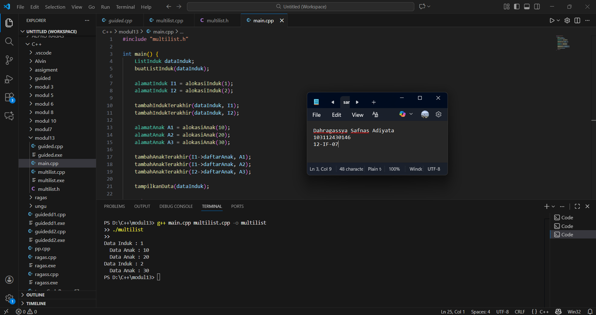
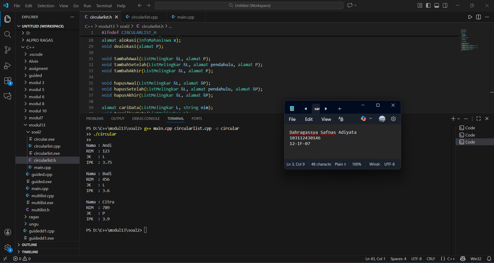

# <h1 align="center">Laporan Praktikum Modul 13 Multi Linked List <br> Stack</h1>
<p align="center">Dahragassya Safnas Adiyata - 103112430146</p>

## Dasar Teori
Multi Linked List adalah struktur data yang merupakan pengembangan dari linked list biasa, di mana setiap node memiliki lebih dari satu pointer untuk menghubungkan node tersebut ke beberapa node lain. Struktur ini memungkinkan satu data memiliki lebih dari satu relasi, sehingga sangat cocok digunakan untuk merepresentasikan hubungan yang kompleks seperti relasi many-to-many, contohnya hubungan antara mahasiswa dengan mata kuliah atau dosen dengan kelas. Dalam implementasinya menggunakan bahasa pemrograman C++, Multi Linked List dibangun dengan memanfaatkan struktur struct atau class yang berisi data serta beberapa pointer yang menunjuk ke node lain. Penggunaan pointer ini memungkinkan pengelolaan data secara dinamis di memori, sehingga penambahan, penghapusan, dan pencarian data dapat dilakukan secara fleksibel. Dengan kemampuan merepresentasikan lebih dari satu hubungan dalam satu struktur, Multi Linked List banyak digunakan pada sistem informasi dan aplikasi yang membutuhkan pemodelan relasi data yang kompleks.

## Guide

```go
#include <iostream>
#include <string>
using namespace std;

struct ChildNode
{
    string info;
    ChildNode *next;
};

struct ParentNode
{
    string info;
    ChildNode *childHead;
    ParentNode *next;
};

ParentNode *createParent(string info)
{
    ParentNode *newNode = new ParentNode;
    newNode->info = info;
    newNode->childHead = NULL;
    newNode->next = NULL;
    return newNode;
}

ChildNode *createChild(string info)
{
    ChildNode *newNode = new ChildNode;
    newNode->info = info;
    newNode->next = NULL;
    return newNode;
}

void insertParent(ParentNode *&head, string info)
{
    ParentNode *newNode = createParent(info);
    if (head == NULL)
    {
        head = newNode;
    }
    else
    {
        ParentNode *temp = head;
        while (temp->next != NULL)
        {
            temp = temp->next;
        }
        temp->next = newNode;
    }
}

void insertChild(ParentNode *head, string parentInfo, string childInfo)
{
    ParentNode *p = head;
    while (p != NULL && p->info != parentInfo)
    {
        p = p->next;
    }
    
    if (p != NULL)
    {
        ChildNode *newChild = createChild(childInfo);
        
        if (p->childHead == NULL)
        {
            p->childHead = newChild;
        }
        else
        {
            ChildNode *c = p->childHead;
            while (c->next != NULL)
            {
                c = c->next;
            }
            c->next = newChild;
        }
    }
}

void printAll(ParentNode *head)
{
    ParentNode *p = head;
    while (p != NULL)
    {
        cout << p->info;
        ChildNode *c = p->childHead;
        if (c != NULL)
        {
            while (c != NULL)
            {
                cout << " -> " << c->info;
                c = c->next;
            }
        }
     cout << endl;
        p = p->next;
    }
}

int main()
{
    ParentNode *list = NULL;
    
    insertParent(list, "Parent Node 1");
    insertParent(list, "Parent Node 2");
    
    printAll(list);
    cout << "\n";
    
    insertChild(list, "Parent Node 1", "Child Node A");
    insertChild(list, "Parent Node 1", "Child Node B");
    insertChild(list, "Parent Node 2", "Child Node C");
    
    printAll(list);
    
    return 0;
}
```
> Output
> 


## UNGUIDED 
### unguided1
#### multilist.h
```c++
#ifndef MULTILIST_H
#define MULTILIST_H

#include <iostream>
using namespace std;

#define NIL NULL
typedef bool boolean;

typedef int tipeInduk;
typedef int tipeAnak;

typedef struct ElemenInduk* alamatInduk;
typedef struct ElemenAnak* alamatAnak;

struct ElemenAnak {
    tipeAnak info;
    alamatAnak next;
    alamatAnak prev;
};

struct ListAnak {
    alamatAnak pertama;
    alamatAnak terakhir;
};

struct ElemenInduk {
    tipeInduk info;
    ListAnak daftarAnak;
    alamatInduk next;
    alamatInduk prev;
};

struct ListInduk {
    alamatInduk pertama;
    alamatInduk terakhir;
};

boolean kosongInduk(ListInduk L);
boolean kosongAnak(ListAnak L);

void buatListInduk(ListInduk &L);
void buatListAnak(ListAnak &L);

alamatInduk alokasiInduk(tipeInduk X);
alamatAnak alokasiAnak(tipeAnak X);
void dealokasiInduk(alamatInduk P);
void dealokasiAnak(alamatAnak P);

alamatInduk cariInduk(ListInduk L, tipeInduk X);
alamatAnak cariAnak(ListAnak L, tipeAnak X);

void tambahIndukTerakhir(ListInduk &L, alamatInduk P);
void tambahAnakTerakhir(ListAnak &L, alamatAnak P);

void hapusIndukTerakhir(ListInduk &L, alamatInduk &P);
void hapusAnakTerakhir(ListAnak &L, alamatAnak &P);

void tampilkanData(ListInduk L);

#endif

```
#### multilist.cpp
```c++
#include "multilist.h"

boolean kosongInduk(ListInduk L) {
    return L.pertama == NIL;
}

boolean kosongAnak(ListAnak L) {
    return L.pertama == NIL;
}

void buatListInduk(ListInduk &L) {
    L.pertama = NIL;
    L.terakhir = NIL;
}

void buatListAnak(ListAnak &L) {
    L.pertama = NIL;
    L.terakhir = NIL;
}

alamatInduk alokasiInduk(tipeInduk X) {
    alamatInduk P = new ElemenInduk;
    P->info = X;
    buatListAnak(P->daftarAnak);
    P->next = NIL;
    P->prev = NIL;
    return P;
}

alamatAnak alokasiAnak(tipeAnak X) {
    alamatAnak P = new ElemenAnak;
    P->info = X;
    P->next = NIL;
    P->prev = NIL;
    return P;
}

void dealokasiInduk(alamatInduk P) {
    delete P;
}

void dealokasiAnak(alamatAnak P) {
    delete P;
}

alamatInduk cariInduk(ListInduk L, tipeInduk X) {
    alamatInduk P = L.pertama;
    while (P != NIL) {
        if (P->info == X)
            return P;
        P = P->next;
    }
    return NIL;
}

alamatAnak cariAnak(ListAnak L, tipeAnak X) {
    alamatAnak P = L.pertama;
    while (P != NIL) {
        if (P->info == X)
            return P;
        P = P->next;
    }
    return NIL;
}

void tambahIndukTerakhir(ListInduk &L, alamatInduk P) {
    if (kosongInduk(L)) {
        L.pertama = P;
        L.terakhir = P;
    } else {
        L.terakhir->next = P;
        P->prev = L.terakhir;
        L.terakhir = P;
    }
}

void tambahAnakTerakhir(ListAnak &L, alamatAnak P) {
    if (kosongAnak(L)) {
        L.pertama = P;
        L.terakhir = P;
    } else {
        L.terakhir->next = P;
        P->prev = L.terakhir;
        L.terakhir = P;
    }
}

void hapusIndukTerakhir(ListInduk &L, alamatInduk &P) {
    if (!kosongInduk(L)) {
        P = L.terakhir;
        if (L.pertama == L.terakhir) {
            L.pertama = NIL;
            L.terakhir = NIL;
        } else {
            L.terakhir = P->prev;
            L.terakhir->next = NIL;
            P->prev = NIL;
        }
    }
}

void hapusAnakTerakhir(ListAnak &L, alamatAnak &P) {
    if (!kosongAnak(L)) {
        P = L.terakhir;
        if (L.pertama == L.terakhir) {
            L.pertama = NIL;
            L.terakhir = NIL;
        } else {
            L.terakhir = P->prev;
            L.terakhir->next = NIL;
            P->prev = NIL;
        }
    }
}

void tampilkanData(ListInduk L) {
    alamatInduk P = L.pertama;
    while (P != NIL) {
        cout << "Data Induk : " << P->info << endl;
        alamatAnak A = P->daftarAnak.pertama;
        while (A != NIL) {
            cout << "  Data Anak : " << A->info << endl;
            A = A->next;
        }
        P = P->next;
    }
}

```
#### main.cpp
```c++
#include "multilist.h"

int main() {
    ListInduk dataInduk;
    buatListInduk(dataInduk);

    alamatInduk I1 = alokasiInduk(1);
    alamatInduk I2 = alokasiInduk(2);

    tambahIndukTerakhir(dataInduk, I1);
    tambahIndukTerakhir(dataInduk, I2);

    alamatAnak A1 = alokasiAnak(10);
    alamatAnak A2 = alokasiAnak(20);
    alamatAnak A3 = alokasiAnak(30);

    tambahAnakTerakhir(I1->daftarAnak, A1);
    tambahAnakTerakhir(I1->daftarAnak, A2);
    tambahAnakTerakhir(I2->daftarAnak, A3);

    tampilkanData(dataInduk);

    return 0;
}

```
> Output
> 

program tersebut terdiri dari file header (multilist.h), file implementasi (multilist.cpp), dan program utama (main.cpp) yang digunakan untuk membangun dan mengelola struktur data Multi Linked List dengan hubungan induk–anak menggunakan bahasa pemrograman C++. File multilist.h berfungsi sebagai tempat pendefinisian tipe data, struktur list induk dan list anak, serta deklarasi seluruh fungsi yang digunakan, sehingga program menjadi lebih terstruktur dan mudah dipahami. File multilist.cpp berisi implementasi dari fungsi-fungsi tersebut, seperti pembuatan list, alokasi dan dealokasi memori, penambahan dan penghapusan data induk maupun anak, proses pencarian data, serta penampilan seluruh isi list dengan relasi induk dan anaknya. Sementara itu, file main.cpp merupakan program utama yang digunakan untuk menguji kebenaran program dengan cara membuat list induk, menambahkan beberapa data induk dan data anak ke dalam struktur multi linked list, kemudian menampilkan seluruh data yang tersimpan. Dengan pemisahan program ke dalam tiga file ini, pengelolaan kode menjadi lebih rapi, modular, dan memudahkan proses pengembangan serta pemeliharaan program.

### unguided2

#### circularlist.h
```c++
#ifndef CIRCULARLIST_H
#define CIRCULARLIST_H

#include <iostream>
using namespace std;

#define NIL NULL

typedef struct {
    string nama;
    string nim;
    char jenisKelamin;
    float ipk;
} InfoMahasiswa;

typedef struct Elemen* alamat;

struct Elemen {
    InfoMahasiswa info;
    alamat next;
};

struct ListMelingkar {
    alamat pertama;
};

void buatList(ListMelingkar &L);
alamat alokasi(InfoMahasiswa x);
void dealokasi(alamat P);

void tambahAwal(ListMelingkar &L, alamat P);
void tambahSetelah(ListMelingkar &L, alamat pendahulu, alamat P);
void tambahAkhir(ListMelingkar &L, alamat P);

void hapusAwal(ListMelingkar &L, alamat &P);
void hapusSetelah(ListMelingkar &L, alamat pendahulu, alamat &P);
void hapusAkhir(ListMelingkar &L, alamat &P);

alamat cariData(ListMelingkar L, string nim);
void tampilkanData(ListMelingkar L);

#endif

```
#### circularlist.cpp
```c++
#include "circularlist.h"

void buatList(ListMelingkar &L) {
    L.pertama = NIL;
}

alamat alokasi(InfoMahasiswa x) {
    alamat P = new Elemen;
    P->info = x;
    P->next = NIL;
    return P;
}

void dealokasi(alamat P) {
    delete P;
}

void tambahAwal(ListMelingkar &L, alamat P) {
    if (L.pertama == NIL) {
        L.pertama = P;
        P->next = P;
    } else {
        alamat Q = L.pertama;
        while (Q->next != L.pertama) {
            Q = Q->next;
        }
        P->next = L.pertama;
        Q->next = P;
        L.pertama = P;
    }
}

void tambahAkhir(ListMelingkar &L, alamat P) {
    if (L.pertama == NIL) {
        L.pertama = P;
        P->next = P;
    } else {
        alamat Q = L.pertama;
        while (Q->next != L.pertama) {
            Q = Q->next;
        }
        Q->next = P;
        P->next = L.pertama;
    }
}

void tambahSetelah(ListMelingkar &L, alamat pendahulu, alamat P) {
    P->next = pendahulu->next;
    pendahulu->next = P;
}

void hapusAwal(ListMelingkar &L, alamat &P) {
    if (L.pertama != NIL) {
        alamat Q = L.pertama;
        while (Q->next != L.pertama) {
            Q = Q->next;
        }
        P = L.pertama;
        if (P->next == P) {
            L.pertama = NIL;
        } else {
            L.pertama = P->next;
            Q->next = L.pertama;
        }
        P->next = NIL;
    }
}

void hapusAkhir(ListMelingkar &L, alamat &P) {
    if (L.pertama != NIL) {
        alamat Q = L.pertama;
        alamat R = NIL;
        while (Q->next != L.pertama) {
            R = Q;
            Q = Q->next;
        }
        P = Q;
        if (R == NIL) {
            L.pertama = NIL;
        } else {
            R->next = L.pertama;
        }
        P->next = NIL;
    }
}

void hapusSetelah(ListMelingkar &L, alamat pendahulu, alamat &P) {
    P = pendahulu->next;
    pendahulu->next = P->next;
    P->next = NIL;
}

alamat cariData(ListMelingkar L, string nim) {
    if (L.pertama == NIL) return NIL;
    alamat P = L.pertama;
    do {
        if (P->info.nim == nim)
            return P;
        P = P->next;
    } while (P != L.pertama);
    return NIL;
}

void tampilkanData(ListMelingkar L) {
    if (L.pertama != NIL) {
        alamat P = L.pertama;
        do {
            cout << "Nama : " << P->info.nama << endl;
            cout << "NIM  : " << P->info.nim << endl;
            cout << "JK   : " << P->info.jenisKelamin << endl;
            cout << "IPK  : " << P->info.ipk << endl;
            cout << endl;
            P = P->next;
        } while (P != L.pertama);
    }
}

```
#### main.cpp
```c++
#include "circularlist.h"

int main() {
    ListMelingkar L;
    buatList(L);

    InfoMahasiswa m1 = {"Andi", "123", 'L', 3.75};
    InfoMahasiswa m2 = {"Budi", "456", 'L', 3.60};
    InfoMahasiswa m3 = {"Citra", "789", 'P', 3.90};

    alamat P1 = alokasi(m1);
    alamat P2 = alokasi(m2);
    alamat P3 = alokasi(m3);

    tambahAwal(L, P1);
    tambahAkhir(L, P2);
    tambahAkhir(L, P3);

    tampilkanData(L);

    return 0;
}

```

> Output
> 

Program ini terdiri dari tiga bagian utama, yaitu file header (circularlist.h), file implementasi (circularlist.cpp), dan file utama (main.cpp) yang digunakan untuk mengimplementasikan struktur data Circular Singly Linked List dengan bahasa pemrograman C++. Pada file header didefinisikan tipe data mahasiswa yang berisi nama, NIM, jenis kelamin, dan IPK, struktur elemen list yang memiliki pointer ke elemen berikutnya, serta deklarasi seluruh fungsi yang digunakan untuk pengelolaan list. File implementasi berisi realisasi fungsi-fungsi tersebut, mulai dari pembuatan list, alokasi dan dealokasi memori, proses penambahan data di awal, di tengah, dan di akhir list, penghapusan data, pencarian data berdasarkan NIM, hingga penampilan seluruh isi list. File main.cpp berperan sebagai program utama untuk menguji jalannya program dengan cara membuat list melingkar, menambahkan beberapa data mahasiswa ke dalam list, dan menampilkan seluruh data yang tersimpan. Dengan menggunakan konsep circular linked list, elemen terakhir pada list akan selalu terhubung kembali ke elemen pertama, sehingga struktur data ini cocok digunakan untuk aplikasi yang membutuhkan perputaran data secara terus-menerus.
## Referensi

1. https://www.geeksforgeeks.org/multilist-in-data-structure/
2. https://www.tutorialspoint.com/data_structures_algorithms/linked_list_algorithms.htm
3. https://www.programiz.com/dsa/linked-list
4. https://www.geeksforgeeks.org/circular-linked-list/
5. https://www.programiz.com/dsa/circular-linked-list
6. https://www.javatpoint.com/multi-linked-list-in-data-structure
7. https://www.javatpoint.com/circular-linked-list
8. https://www.geeksforgeeks.org/doubly-linked-list/
