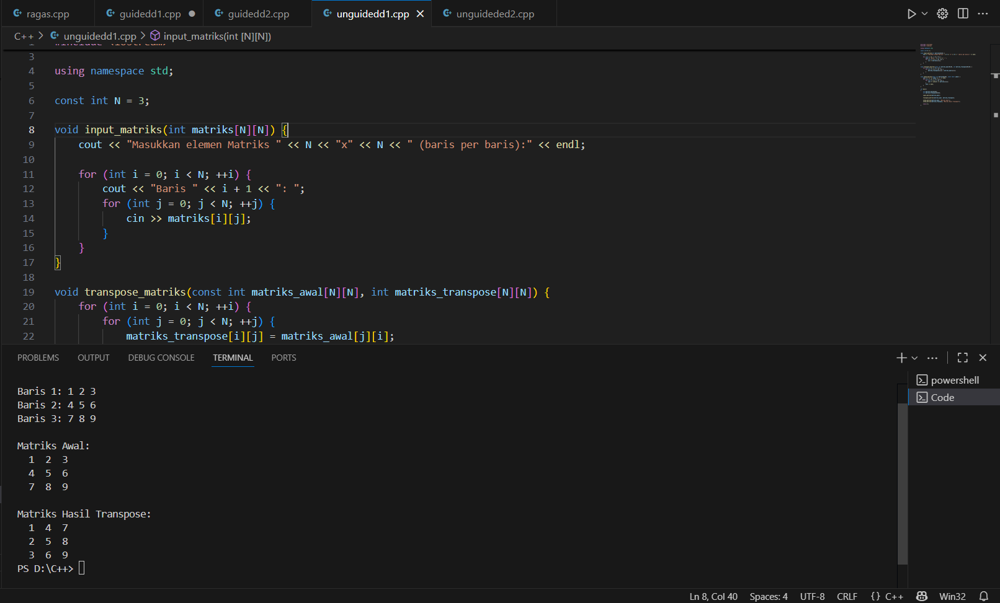

# <h1 align="center">Laporan Praktikum Modul 2 <br> ARRAY </h1>
<p align="center">Dahragassya Safnas Adiyata - 103112430146</p>

## Dasar Teori

Array dalam C++ merupakan struktur data yang menyimpan sekelompok elemen data dengan tipe yang seragam dalam tempat penyimpanan memori yang berdekatan, diakses melalui indeks yang dimulai dari nol. Array memiliki ukuran tetap yang ditentukan saat pembentukan, dan menawarkan cara efisien untuk menyimpan dan mengelola banyak data serupa, seperti angka atau string, dalam satu variabel


## Guided

### guided 1
   ```c++
#include <iostream>
using namespace std;

void kuadratkan(int &angka)
{
    angka = angka * angka;
}

int main()
{
    int nilai;

    cout << "Masukkan nilai awal yang ingin dikuadratkan: ";
    cin >> nilai;

    cout << "Nilai awal: " << nilai << endl;

    kuadratkan(nilai);

    cout << "Nilai setelah dikuadratkan: " << nilai << endl;

    return 0;
}

```

Kode program C++ ini secara efektif mendemonstrasikan Call by Reference dengan tujuan mengkuadratkan sebuah bilangan bulat. Program dimulai dengan meminta pengguna memasukkan nilai awal ke dalam variabel nilai. Inti dari kode terletak pada fungsi kuadratkan(int &angka), di mana tanda ampersand (&) pada parameternya menunjukkan bahwa angka adalah referensi—bukan salinan—dari variabel nilai asli di main(). Akibatnya, ketika angka = angka * angka dijalankan, ia langsung memodifikasi nilai variabel nilai di lokasi memori aslinya. Program kemudian mencetak nilai nilai yang telah diubah menjadi kuadratnya, membuktikan keberhasilan call by reference dalam memodifikasi variabel di luar fungsi pemanggil

> Output
> 


### guided 2


```c++
#include <iostream>
using namespace std;

void tukar(int *px, int *py);

int main()
{   
    int a = 10, b = 20;
    
    cout << "Sebelum ditukar: a = " << a << ", b = " << b << endl; 
    
    tukar(&a, &b); 
    
    cout << "Setelah ditukar: a = " << a << ", b = " << b << endl;
    
    return 0;
}

void tukar(int *px, int *py)
{
    int temp = *px; 
    
    *px = *py; 
    
    *py = temp; 
}
```
Kode program C++ ini mendemonstrasikan Call by Reference menggunakan pointer untuk menukar nilai dua variabel integer, a dan b. Fungsi main() menginisialisasi a = 10 dan b = 20, kemudian memanggil prosedur tukar dengan melewatkan alamat memori dari a dan b menggunakan operator address-of (&a, &b). Di dalam fungsi tukar, parameter *px dan *py adalah pointer yang menerima alamat-alamat tersebut. Fungsi ini berhasil menukar nilai a dan b secara permanen dengan melakukan swapping pada nilai yang ditunjuk (menggunakan operator dereference *), sehingga setelah tukar selesai, main() mencetak nilai a = 20 dan b = 10, membuktikan bahwa nilai asli variabel telah diubah.

> Output
> 


## Unguided

### Soal 1

```c++
#include <iostream>
#include <iomanip>

using namespace std;

const int N = 3;

void input_matriks(int matriks[N][N]) {
    cout << "Masukkan elemen Matriks " << N << "x" << N << " (baris per baris):" << endl;
    
    for (int i = 0; i < N; ++i) {
        cout << "Baris " << i + 1 << ": ";
        for (int j = 0; j < N; ++j) {
            cin >> matriks[i][j];
        }
    }
}

void transpose_matriks(const int matriks_awal[N][N], int matriks_transpose[N][N]) {
    for (int i = 0; i < N; ++i) {
        for (int j = 0; j < N; ++j) {
            matriks_transpose[i][j] = matriks_awal[j][i];
        }
    }
}

void cetak_matriks(const int matriks[N][N], const char* judul) {
    cout << "\n" << judul << ":" << endl;
    for (int i = 0; i < N; ++i) {
        for (int j = 0; j < N; ++j) {
            cout << setw(3) << matriks[i][j];
        }
        cout << endl;
    }
}

int main()
{
    int matriks_awal[N][N];
    int matriks_transpose[N][N];
    
    input_matriks(matriks_awal);
    
    transpose_matriks(matriks_awal, matriks_transpose);
    
    cetak_matriks(matriks_awal, "Matriks Awal");
    cetak_matriks(matriks_transpose, "Matriks Hasil Transpose");

    return 0;
}
```
>

Kode program C++ ini dirancang untuk melakukan transpose (mengubah baris menjadi kolom) pada sebuah matriks 3×3, dengan memisahkan tugas menjadi tiga fungsi utama demi kejelasan dan modularitas. Fungsi input_matriks bertugas meminta sembilan angka dari pengguna (tiga per baris) untuk mengisi matriks_awal. Fungsi transpose_matriks kemudian memproses matriks tersebut menggunakan logika inti matriks_transpose[i][j] = matriks_awal[j][i]. Terakhir, fungsi cetak_matriks bertanggung jawab mencetak kedua matriks (awal dan hasil transpose) ke layar dengan rapi menggunakan std::setw(3). Fungsi main() hanya berfungsi sebagai orkestrator yang memanggil ketiga fungsi ini secara berurutan untuk menyelesaikan seluruh proses
> Output
> 


### Soal 2

soal nomor 2

```c++
#include <iostream>

using namespace std;

void kuadratkan(int &angka)
{
    angka = angka * angka;
}

int main()
{
    int nilai;

    cout << "Masukkan nilai awal yang ingin dikuadratkan: ";
    cin >> nilai;

    cout << "Nilai awal: " << nilai << endl;

    kuadratkan(nilai);

    cout << "Nilai setelah dikuadratkan: " << nilai << endl;

    return 0;
}
```

Kode ini meminta pengguna memasukkan sebuah angka (nilai). Kemudian, ia memanggil fungsi kuadratkan, yang didefinisikan menggunakan referensi (&). Karena ada tanda &, fungsi tersebut tidak membuat salinan dari nilai, melainkan mendapatkan akses langsung ke variabel nilai yang asli di memori. Ketika angka = angka * angka dijalankan di dalam fungsi, ia mengubah nilai variabel asli (nilai) menjadi kuadratnya. Hasilnya, nilai yang dicetak sebelum dan sesudah pemanggilan fungsi akan berbeda, membuktikan bahwa fungsi berhasil mengubah variabel nilai secara permanen.

> Output
> 
