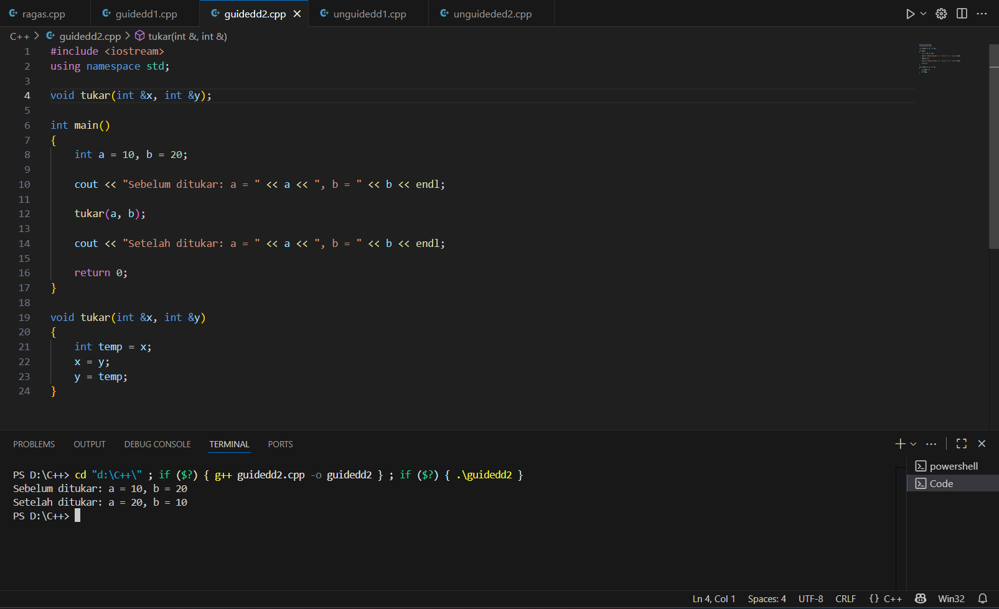

# <h1 align="center">Laporan Praktikum Modul 3 <br> Abstract Data Type </h1>
<p align="center">Dahragassya Safnas Adiyata - 103112430146</p>

## Dasar Teori

Abstract Data Type (ADT), atau Tipe Data Abstrak, adalah konsep fundamental dalam ilmu komputer yang mendefinisikan sebuah tipe data dari sudut pandang logis atau matematis, bukan dari sudut pandang implementasi fisiknya. ADT adalah spesifikasi tentang apa yang dilakukan oleh suatu tipe data, yang terdiri dari dua komponen utama: koleksi data yang akan disimpan, dan set operasi (fungsi atau metode) yang dapat diterapkan pada data tersebut. . Inti dari ADT adalah abstraksi, di mana kita memisahkan definisi fungsional (antarmuka publik) dari detail implementasi internal (struktur data yang mendasarinya dan kode algoritmik). Misalnya, kita mendefinisikan ADT Stack dengan operasi push (tambah) dan pop (ambil), tanpa peduli apakah Stack tersebut nantinya akan diimplementasikan menggunakan array atau linked list.


## Guided

### guided 1
   ```c++
#include <iostream>
using namespace std;

void kuadratkan(int &angka)
{
    angka = angka * angka;
}

int main()
{
    int nilai;

    cout << "Masukkan nilai awal yang ingin dikuadratkan: ";
    cin >> nilai;

    cout << "Nilai awal: " << nilai << endl;

    kuadratkan(nilai);

    cout << "Nilai setelah dikuadratkan: " << nilai << endl;

    return 0;
}

```

Kode ini mendemonstrasikan Call by Pointer, di mana fungsi tukar menerima alamat memori (&a, &b) melalui parameter pointer (*px, *py). Dengan menggunakan operator dereference (*), fungsi tersebut langsung mengakses dan menukar nilai yang ada di lokasi memori tersebut. Hasilnya, nilai asli variabel a dan b di main() diubah secara permanen (dari 10,20 menjadi 20,10), membuktikan bahwa fungsi berhasil memanipulasi variabel di luar cakupannya.

> Output
> 


### guided 2


```c++
#include <iostream>
using namespace std;

void tukar(int *px, int *py);

int main()
{   
    int a = 10, b = 20;
    
    cout << "Sebelum ditukar: a = " << a << ", b = " << b << endl; 
    
    tukar(&a, &b); 
    
    cout << "Setelah ditukar: a = " << a << ", b = " << b << endl;
    
    return 0;
}

void tukar(int *px, int *py)
{
    int temp = *px; 
    
    *px = *py; 
    
    *py = temp; 
}
```
Kode program C++ ini mendemonstrasikan Call by Reference menggunakan pointer untuk menukar nilai dua variabel integer, a dan b. Fungsi main() menginisialisasi a = 10 dan b = 20, kemudian memanggil prosedur tukar dengan melewatkan alamat memori dari a dan b menggunakan operator address-of (&a, &b). Di dalam fungsi tukar, parameter *px dan *py adalah pointer yang menerima alamat-alamat tersebut. Fungsi ini berhasil menukar nilai a dan b secara permanen dengan melakukan swapping pada nilai yang ditunjuk (menggunakan operator dereference *), sehingga setelah tukar selesai, main() mencetak nilai a = 20 dan b = 10, membuktikan bahwa nilai asli variabel telah diubah.

> Output
> 


## Unguided

### Soal 1

```c++
#include <iostream>
#include <iomanip>

using namespace std;

const int N = 3;

void input_matriks(int matriks[N][N]) {
    cout << "Masukkan elemen Matriks " << N << "x" << N << " (baris per baris):" << endl;
    
    for (int i = 0; i < N; ++i) {
        cout << "Baris " << i + 1 << ": ";
        for (int j = 0; j < N; ++j) {
            cin >> matriks[i][j];
        }
    }
}

void transpose_matriks(const int matriks_awal[N][N], int matriks_transpose[N][N]) {
    for (int i = 0; i < N; ++i) {
        for (int j = 0; j < N; ++j) {
            matriks_transpose[i][j] = matriks_awal[j][i];
        }
    }
}

void cetak_matriks(const int matriks[N][N], const char* judul) {
    cout << "\n" << judul << ":" << endl;
    for (int i = 0; i < N; ++i) {
        for (int j = 0; j < N; ++j) {
            cout << setw(3) << matriks[i][j];
        }
        cout << endl;
    }
}

int main()
{
    int matriks_awal[N][N];
    int matriks_transpose[N][N];
    
    input_matriks(matriks_awal);
    
    transpose_matriks(matriks_awal, matriks_transpose);
    
    cetak_matriks(matriks_awal, "Matriks Awal");
    cetak_matriks(matriks_transpose, "Matriks Hasil Transpose");

    return 0;
}
```
>

Kode program C++ ini dirancang untuk melakukan transpose (mengubah baris menjadi kolom) pada sebuah matriks 3×3, dengan memisahkan tugas menjadi tiga fungsi utama demi kejelasan dan modularitas. Fungsi input_matriks bertugas meminta sembilan angka dari pengguna (tiga per baris) untuk mengisi matriks_awal. Fungsi transpose_matriks kemudian memproses matriks tersebut menggunakan logika inti matriks_transpose[i][j] = matriks_awal[j][i]. Terakhir, fungsi cetak_matriks bertanggung jawab mencetak kedua matriks (awal dan hasil transpose) ke layar dengan rapi menggunakan std::setw(3). Fungsi main() hanya berfungsi sebagai orkestrator yang memanggil ketiga fungsi ini secara berurutan untuk menyelesaikan seluruh proses
> Output
> 


