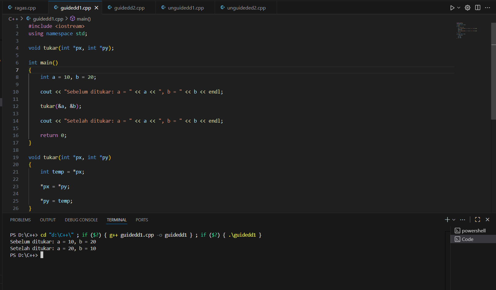
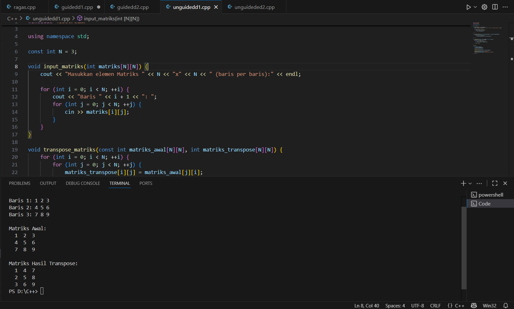

# <h1 align="center">Laporan Praktikum Modul 4 <br> SINGLY LINKED LIST </h1>
<p align="center">Dahragassya Safnas Adiyata - 103112430146</p>

## Dasar Teori

Singly Linked List merupakan struktur data linier yang bersifat dinamis, di mana elemen yang dikenal sebagai node (simpul) tidak disimpan dalam lokasi memori yang berdekatan, tetapi tersebar dan saling terhubung secara berurutan. Setiap node terdiri dari dua elemen: data dan sebuah pointer (next) yang menyimpan alamat memori dari node berikutnya dalam urutan. Seluruh daftar dikendalikan oleh satu pointer eksternal bernama Head yang menunjuk ke node pertama; jika Head adalah NULL, daftar dianggap kosong. Daftar ini memiliki sifat satu arah, yang menunjukkan bahwa traversal dan akses data hanya dapat dimulai dari Head ke depan melalui rangkaian pointer next, menjadikan operasi penyisipan dan penghapusan di awal daftar sangat efisien (O(1)), meskipun akses elemen di tengah membutuhkan waktu yang sebanding dengan panjang daftar (O(N))


## Guided

### guided 1
   ```c++
#include <iostream>
using namespace std;

// Struktur Node
struct Node {
    int data;
    Node* next;
};

// Pointer kepala (head)
Node* kepala = nullptr;

// Fungsi untuk membuat node baru
Node* buatNode(int data) {
    Node* nodeBaru = new Node();
    nodeBaru->data = data;
    nodeBaru->next = nullptr;
    return nodeBaru;
}

// Fungsi untuk menyisipkan node di depan
void sisipDepan(int data) {
    Node* nodeBaru = buatNode(data);
    nodeBaru->next = kepala; // Node baru menunjuk ke kepala lama
    kepala = nodeBaru;       // Kepala sekarang menunjuk ke node baru
    cout << "Data " << data << " berhasil disisipkan di depan.\n";
}

// Fungsi untuk menyisipkan node di belakang
void sisipBelakang(int data) {
    Node* nodeBaru = buatNode(data);
    if (kepala == nullptr) {
        kepala = nodeBaru;
    } else {
        Node* temp = kepala;
        while (temp->next != nullptr) {
            temp = temp->next;
        }
        temp->next = nodeBaru;
    }
    cout << "Data " << data << " berhasil disisipkan di belakang.\n";
}

// Fungsi untuk menyisipkan node setelah node tertentu
void sisipSetelah(int target, int dataBaru) {
    Node* temp = kepala;
    while (temp != nullptr && temp->data != target) {
        temp = temp->next;
    }

    if (temp == nullptr) {
        cout << "Data target " << target << " tidak ditemukan!\n";
    } else {
        Node* nodeBaru = buatNode(dataBaru);
        nodeBaru->next = temp->next;
        temp->next = nodeBaru;
        cout << "Data " << dataBaru << " berhasil disisipkan setelah " << target << ".\n";
    }
}

// ========== FUNGSI HAPUS ==========
void hapusNode(int data) {
    if (kepala == nullptr) {
        cout << "List kosong!\n";
        return;
    }

    Node* temp = kepala;
    Node* sebelumnya = nullptr;

    // Kasus 1: Jika data di node pertama (kepala)
    if (temp != nullptr && temp->data == data) {
        kepala = temp->next;
        delete temp;
        cout << "Data " << data << " berhasil dihapus.\n";
        return;
    }

    // Kasus 2: Cari node yang akan dihapus
    while (temp != nullptr && temp->data != data) {
        sebelumnya = temp;
        temp = temp->next;
    }

    // Jika data tidak ditemukan
    if (temp == nullptr) {
        cout << "Data " << data << " tidak ditemukan!\n";
        return;
    }

    // Lepaskan node dari list dan bebaskan memori
    sebelumnya->next = temp->next;
    delete temp;
    cout << "Data " << data << " berhasil dihapus.\n";
}

// ========== FUNGSI PERBARUI ==========
void perbaruiNode(int dataLama, int dataBaru) {
    Node* temp = kepala;
    while (temp != nullptr && temp->data != dataLama) {
        temp = temp->next;
    }

    if (temp == nullptr) {
        cout << "Data " << dataLama << " tidak ditemukan!\n";
    } else {
        temp->data = dataBaru;
        cout << "Data " << dataLama << " berhasil diperbarui menjadi " << dataBaru << ".\n";
    }
}

// ========== FUNGSI TAMPILKAN ==========
void tampilkanList() {
    if (kepala == nullptr) {
        cout << "List kosong!\n";
        return;
    }

    Node* temp = kepala;
    cout << "Isi Linked List: ";
    while (temp != nullptr) {
        cout << temp->data << " -> ";
        temp = temp->next;
    }
    cout << "NULL\n";
}

// ========== PROGRAM UTAMA ==========
int main() {
    int pilihan, data, target, dataBaru;

    do {
        cout << "\n=== MENU SINGLE LINKED LIST ===\n";
        cout << "1. Sisip Depan\n";
        cout << "2. Sisip Belakang\n";
        cout << "3. Sisip Setelah\n";
        cout << "4. Hapus Data\n";
        cout << "5. Perbarui Data\n";
        cout << "6. Tampilkan List\n";
        cout << "0. Keluar\n";
        cout << "Pilih opsi: ";
        cin >> pilihan;

        switch (pilihan) {
            case 1:
                cout << "Masukkan data: ";
                cin >> data;
                sisipDepan(data);
                break;
            case 2:
                cout << "Masukkan data: ";
                cin >> data;
                sisipBelakang(data);
                break;
            case 3:
                cout << "Masukkan data target: ";
                cin >> target;
                cout << "Masukkan data baru: ";
                cin >> dataBaru;
                sisipSetelah(target, dataBaru);
                break;
            case 4:
                cout << "Masukkan data yang ingin dihapus: ";
                cin >> data;
                hapusNode(data);
                break;
            case 5:
                cout << "Masukkan data lama: ";
                cin >> data;
                cout << "Masukkan data baru: ";
                cin >> dataBaru;
                perbaruiNode(data, dataBaru);
                break;
            case 6:
                tampilkanList();
                break;
            case 0:
                cout << "Program selesai.\n";
                break;
            default:
                cout << "Pilihan tidak valid!\n";
        }
    } while (pilihan != 0);

    return 0;
}
```

Kode di atas mengimplementasikan struktur data Single Linked List (Senarai Berantai Tunggal) dalam Bahasa Indonesia. Program ini menyediakan antarmuka menu untuk melakukan operasi dasar CRUD (Create, Read, Update, Delete) pada list. Secara garis besar, list diwakili oleh struct Node yang menyimpan data integer dan pointer next ke node berikutnya, serta dikontrol oleh pointer kepala (head) global. Fungsi-fungsi seperti sisipDepan, sisipBelakang, dan sisipSetelah menangani penambahan node baru; hapusNode membebaskan memori node yang dicari; perbaruiNode mengubah data node; dan tampilkanList melakukan traversal untuk mencetak semua elemen. Semua operasi ini memanfaatkan pointer next untuk merangkai atau memutuskan rantai node, sehingga list dapat diubah ukurannya secara dinamis.

> Output
> 


## Unguided

### Soal 1

```c++
#include <iostream>
#include <string>
using namespace std;

struct Node {
    string nama;
    string pesanan;
    Node *next;
};

Node *front = nullptr;
Node *rear = nullptr;

bool isEmpty() {
    return front == nullptr;
}

void tambahAntrian(string nama, string pesanan) {
    Node *baru = new Node;
    baru->nama = nama;
    baru->pesanan = pesanan;
    baru->next = nullptr;

    if (isEmpty()) {
        front = rear = baru;
    } else {
        rear->next = baru;
        rear = baru;
    }
    cout << "✅ Antrian berhasil ditambahkan!\n";
}

void layaniAntrian() {
    if (isEmpty()) {
        cout << "⚠️  Antrian kosong, tidak ada yang dilayani!\n";
        return;
    }

    Node *hapus = front;
    cout << "👤 Melayani: " << hapus->nama << " - Pesanan: " << hapus->pesanan << endl;
    front = front->next;

    if (front == nullptr) {
        rear = nullptr; 
    }

    delete hapus;
}

void tampilAntrian() {
    if (isEmpty()) {
        cout << "📭 Antrian kosong!\n";
        return;
    }

    cout << "\n📋 Daftar Antrian:\n";
    Node *temp = front;
    int nomor = 1;
    while (temp != nullptr) {
        cout << nomor << ". " << temp->nama << " - " << temp->pesanan << endl;
        temp = temp->next;
        nomor++;
    }
    cout << endl;
}

int main() {
    int pilihan;
    string nama, pesanan;

    do {
        cout << "==============================\n";
        cout << "     PROGRAM ANTRIAN PEMBELI  \n";
        cout << "==============================\n";
        cout << "1. Tambah Antrian\n";
        cout << "2. Layani Antrian\n";
        cout << "3. Tampilkan Antrian\n";
        cout << "4. Keluar\n";
        cout << "==============================\n";
        cout << "Pilih menu: ";
        cin >> pilihan;
        cin.ignore(); 

        switch (pilihan) {
            case 1:
                cout << "Masukkan Nama Pembeli   : ";
                getline(cin, nama);
                cout << "Masukkan Pesanan        : ";
                getline(cin, pesanan);
                tambahAntrian(nama, pesanan);
                break;
            case 2:
                layaniAntrian();
                break;
            case 3:
                tampilAntrian();
                break;
            case 4:
                cout << "👋 Keluar dari program.\n";
                break;
            default:
                cout << "❌ Pilihan tidak valid!\n";
        }

        cout << endl;
    } while (pilihan != 4);

    return 0;
}
```
>

Kode di atas mengimplementasikan Queue (Antrian) menggunakan Linked List untuk mensimulasikan sistem antrian pembeli (FIFO - First-In, First-Out). Struktur Node menyimpan data nama dan pesanan pelanggan, serta pointer next untuk menunjuk ke node berikutnya. Dua pointer global, front (depan) dan rear (belakang), digunakan untuk mengelola antrian. Fungsi tambahAntrian (enqueue) menambahkan node baru ke rear (belakang list), sementara layaniAntrian (dequeue) menghapus dan memproses node dari front (depan list), menjaga prinsip FIFO. Fungsi tampilAntrian menampilkan seluruh isi antrian dari depan ke belakang. Program utama menyediakan menu interaktif agar pengguna dapat menambah antrian, melayani antrian, dan melihat daftar antrian.


> Output
> 


### Soal 2

```c++
#include <iostream>
using namespace std;

struct Node {
    int data;
    Node* next;
};

Node* head = nullptr;


void tambahNode(int nilai) {
    Node* baru = new Node;
    baru->data = nilai;
    baru->next = nullptr;

    if (head == nullptr) {
        head = baru;
    } else {
        Node* temp = head;
        while (temp->next != nullptr) {
            temp = temp->next;
        }
        temp->next = baru;
    }
}


void tampilList() {
    if (head == nullptr) {
        cout << "Linked List kosong." << endl;
        return;
    }

    Node* temp = head;
    while (temp != nullptr) {
        cout << temp->data;
        if (temp->next != nullptr) cout << " -> ";
        temp = temp->next;
    }
    cout << endl;
}


void reverseList() {
    Node* prev = nullptr;
    Node* current = head;
    Node* next = nullptr;

    while (current != nullptr) {
        next = current->next;   
        current->next = prev;   
        prev = current;         
        current = next;         
    }
    head = prev; 
}

int main() {

    tambahNode(1);
    tambahNode(2);
    tambahNode(3);

    cout << "Linked List sebelum dibalik:\n";
    tampilList();

    reverseList();

    cout << "\nLinked List setelah dibalik:\n";
    tampilList();

    return 0;
}

```
>

Kode ini mendefinisikan struktur Node yang memiliki data integer dan pointer next, dengan pointer global head mengendalikan awal list. Fungsi tambahNode menambahkan elemen baru di akhir list melalui traversal dari head hingga node terakhir. Fungsi tampilList mencetak semua elemen secara berurutan. Inti dari program ini adalah fungsi reverseList, yang membalik urutan list secara iteratif dengan memanipulasi ulang pointer next dari setiap node, menggunakan tiga pointer (prev, current, next) untuk mengubah arah tautan secara sistematis, sehingga head akhirnya menunjuk ke node yang tadinya merupakan node terakhir. Program main menguji fungsionalitas ini dengan membangun list 1 -> 2 -> 3 dan kemudian mencetaknya setelah dibalik menjadi 3 -> 2 -> 1.


> Output
> 


