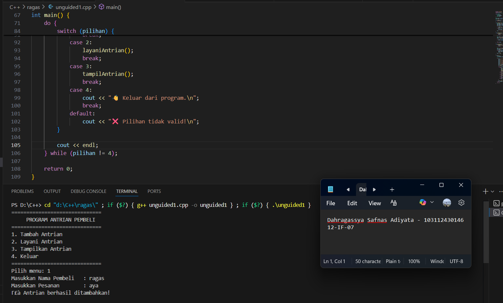
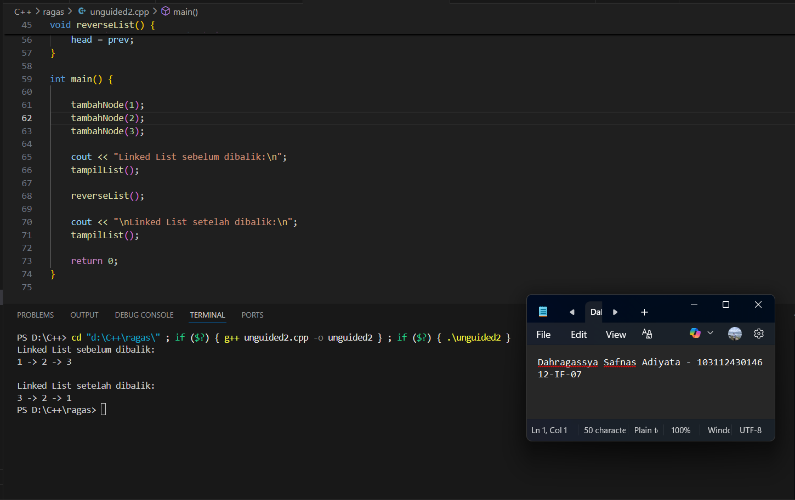

# <h1 align="center">Laporan Praktikum Modul 5 <br> SINGLY LINKED LIST (BAGIAN 2) </h1>
<p align="center">Dahragassya Safnas Adiyata - 103112430146</p>

## Dasar Teori

Singly Linked List merupakan salah satu jenis struktur data yang terdiri atas sekumpulan elemen (node) yang saling terhubung melalui pointer. Setiap node memiliki dua bagian utama: satu untuk menyimpan data dan satu lagi berupa pointer yang menunjuk ke node berikutnya. Tidak seperti array yang memiliki ukuran tetap, singly linked list bersifat dinamis, sehingga memudahkan proses penambahan atau penghapusan elemen tanpa perlu menggeser data lainnya. Beberapa operasi dasar yang umum dilakukan meliputi pembuatan list kosong, penambahan data, penghapusan data, pencarian elemen, serta pembaruan nilai. Proses pencarian dilakukan dengan menelusuri node secara berurutan dari awal hingga elemen yang dicari ditemukan, sedangkan operasi tambah dan hapus dilakukan dengan memodifikasi hubungan pointer antar node. Struktur ini memiliki kelebihan dalam hal fleksibilitas dan efisiensi pengelolaan data, namun kekurangannya adalah akses data harus dilakukan secara berurutan dan membutuhkan ruang memori tambahan untuk menyimpan pointer. Secara keseluruhan, singly linked list menjadi konsep dasar yang penting dalam memahami struktur data yang lebih kompleks seperti doubly linked list dan circular linked list.

### LINKEDLIST.CPP
```go
#include <iostream>
using namespace std;

// Struktur Node
struct Node {
    int data;
    Node* next;
};

// Pointer awal dan akhir
Node* head = nullptr;

// Fungsi untuk membuat node baru
Node* createNode(int data) {
    Node* newNode = new Node();
    newNode->data = data;
    newNode->next = nullptr;
    return newNode;
}


void insertBelakang(int data) {
    Node* newNode = createNode(data);
    if (head == nullptr) {
        head = newNode;
    } else {
        Node* temp = head;
        while (temp->next != nullptr) {
            temp = temp->next;
        }
        temp->next = newNode;
    }
    cout << "Data " << data << " berhasil ditambahkan di belakang.\n";
}

void insertSetelah(int target, int dataBaru) {
    Node* temp = head;
    while (temp != nullptr && temp->data != target) {
        temp = temp->next;
    }

    if (temp == nullptr) {
        cout << "Data " << target << " tidak ditemukan!\n";
    } else {
        Node* newNode = createNode(dataBaru);
        newNode->next = temp->next;
        temp->next = newNode;
        cout << "Data " << dataBaru << " berhasil disisipkan setelah " << target << ".\n";
    }
}

// ========== DELETE FUNCTION ==========
void hapusNode(int data) {
    if (head == nullptr) {
        cout << "List kosong!\n";
        return;
    }

    Node* temp = head;
    Node* prev = nullptr;

    // Jika data di node pertama
    if (temp != nullptr && temp->data == data) {
        head = temp->next;
        delete temp;
        cout << "Data " << data << " berhasil dihapus.\n";
        return;
    }

    // Cari node yang akan dihapus
    while (temp != nullptr && temp->data != data) {
        prev = temp;
        temp = temp->next;
    }

    // Jika data tidak ditemukan
    if (temp == nullptr) {
        cout << "Data " << data << " tidak ditemukan!\n";
        return;
    }

    prev->next = temp->next;
    delete temp;
    cout << "Data " << data << " berhasil dihapus.\n";
}

// ========== UPDATE FUNCTION ==========
void updateNode(int dataLama, int dataBaru) {
    Node* temp = head;
    while (temp != nullptr && temp->data != dataLama) {
        temp = temp->next;
    }

    if (temp == nullptr) {
        cout << "Data " << dataLama << " tidak ditemukan!\n";
    } else {
        temp->data = dataBaru;
        cout << "Data " << dataLama << " berhasil diupdate menjadi " << dataBaru << ".\n";
    }
}

// ========== DISPLAY FUNCTION ==========
void tampilkanList() {
    if (head == nullptr) {
        cout << "List kosong!\n";
        return;
    }

    Node* temp = head;
    cout << "Isi Linked List: ";
    while (temp != nullptr) {
        cout << temp->data << " -> ";
        temp = temp->next
    }
    cout << "NULL\n";
}

// ========== MAIN PROGRAM ==========
int main() {
    int pilihan, data, target, dataBaru;

    do {
        cout << "\n=== MENU SINGLE LINKED LIST ===\n";
        cout << "1. Insert Depan\n";
        cout << "2. Insert Belakang\n";
        cout << "3. Insert Setelah\n";
        cout << "4. Hapus Data\n";
        cout << "5. Update Data\n";
        cout << "6. Tampilkan List\n";
        cout << "0. Keluar\n";
        cout << "Pilih: ";
        cin >> pilihan;

        switch (pilihan) {
            case 1:
                cout << "Masukkan data: ";
                cin >> data;
                insertDepan(data);
                break;
            case 2:
                cout << "Masukkan data: ";
                cin >> data;
                insertBelakang(data);
                break;
            case 3:
                cout << "Masukkan data target: ";
                cin >> target;
                cout << "Masukkan data baru: ";
                cin >> dataBaru;
                insertSetelah(target, dataBaru);
                break;
            case 4:
                cout << "Masukkan data yang ingin dihapus: ";
                cin >> data;
                hapusNode(data);
                break;
            case 5:
                cout << "Masukkan data lama: ";
                cin >> data;
                cout << "Masukkan data baru: ";
                cin >> dataBaru;
                updateNode(data, dataBaru);
                break;
            case 6:
                tampilkanList();
                break;
            case 0:
                cout << "Program selesai.\n";
                break;
            default:
                cout << "Pilihan tidak valid!\n";
        }
    } while (pilihan != 0);

    return 0;
}
```

### SEARCHING.CPP
```go
#include <iostream>
using namespace std;

#define Nil nullptr

// Deklarasi struktur Node
struct Node {
    int info;
    Node* next;

    Node(int value) {
        info = value;
        next = Nil;
    }
};

// Kelas List
class List {
private:
    Node* first;

public:
    // Konstruktor
    List() {
        first = Nil;
    }

    // Mengecek apakah list kosong
    bool isEmpty() {
        return first == Nil;
    }

    // Membuat list kosong
    void createList() {
        first = Nil;
    }

    // Menampilkan isi list
    void printInfo() {
        if (isEmpty()) {
            cout << "List kosong" << endl;
        } else {
            Node* p = first;
            cout << "Isi list: ";
            while (p != Nil) {
                cout << p->info << " ";
                p = p->next;
            }
            cout << endl;
        }
    }

    // Menghitung jumlah elemen
    int nbList() {
        int count = 0;
        Node* p = first;
        while (p != Nil) {
            count++;
            p = p->next;
        }
        return count;
    }

    // Menyisipkan elemen di awal
    void insertFirst(int value) {
        Node* p = new Node(value);
        p->next = first;
        first = p;
    }

    // Menyisipkan elemen di akhir
    void insertLast(int value) {
        Node* p = new Node(value);
        if (isEmpty()) {
            first = p;
        } else {
            Node* last = first;
            while (last->next != Nil) {
                last = last->next;
            }
            last->next = p;
        }
    }

    // Menyisipkan elemen setelah node tertentu
    void insertAfter(Node* prec, int value) {
        if (prec != Nil) {
            Node* p = new Node(value);
            p->next = prec->next;
            prec->next = p;
        }
    }

    // Menghapus elemen pertama
    void delFirst() {
        if (!isEmpty()) {
            Node* temp = first;
            first = first->next;
            delete temp;
        }
    }

    // Menghapus elemen terakhir
    void delLast() {
        if (!isEmpty()) {
            if (first->next == Nil) {
                delete first;
                first = Nil;
            } else {
                Node* prev = Nil;
                Node* curr = first;
                while (curr->next != Nil) {
                    prev = curr;
                    curr = curr->next;
                }
                prev->next = Nil;
                delete curr;
            }
        }
    }

    // Menghapus elemen setelah node tertentu
    void delAfter(Node* prec) {
        if (prec != Nil && prec->next != Nil) {
            Node* temp = prec->next;
            prec->next = temp->next;
            delete temp;
        }
    }

    // Menghapus elemen dengan nilai tertentu
    void delP(int value) {
        if (isEmpty()) return;

        Node* curr = first;
        Node* prev = Nil;

        while (curr != Nil && curr->info != value) {
            prev = curr;
            curr = curr->next;
        }

        if (curr != Nil) { // ditemukan
            if (prev == Nil)
                first = curr->next;
            else
                prev->next = curr->next;
            delete curr;
        }
    }

    // Mencari elemen dengan nilai tertentu
    Node* findElm(int value) {
        Node* p = first;
        while (p != Nil) {
            if (p->info == value)
                return p;
            p = p->next;
        }
        return Nil;
    }

    // Membalik urutan elemen list
    void invertList() {
        Node* prev = Nil;
        Node* curr = first;
        Node* next = Nil;

        while (curr != Nil) {
            next = curr->next;
            curr->next = prev;
            prev = curr;
            curr = next;
        }
        first = prev;
    }

    // Menghapus semua elemen list
    void delAll() {
        Node* p = first;
        while (p != Nil) {
            Node* temp = p;
            p = p->next;
            delete temp;
        }
        first = Nil;
    }

    // Menyalin isi list ke list lain
    void copyList(List &L2) {
        delAll();
        Node* p = first;
        while (p != Nil) {
            L2.insertLast(p->info);
            p = p->next;
        }
    }

    // Destruktor
    ~List() {
        delAll();
    }
};

// Contoh penggunaan dalam main
int main() {
    List L;

    cout << "=== Program Linked List C++ ===" << endl;

    L.insertFirst(10);
    L.insertFirst(5);
    L.insertLast(15);
    L.insertLast(20);

    L.printInfo(); // Output: 5 10 15 20
    cout << "Jumlah elemen: " << L.nbList() << endl;

    cout << "Hapus elemen pertama..." << endl;
    L.delFirst();
    L.printInfo();

    cout << "Hapus elemen terakhir..." << endl;
    L.delLast();
    L.printInfo();

    cout << "Cari elemen bernilai 10..." << endl;
    Node* found = L.findElm(10);
    if (found) cout << "Ditemukan: " << found->info << endl;
    else cout << "Tidak ditemukan" << endl;

    cout << "Balik urutan list..." << endl;
    L.invertList();
    L.printInfo();

    cout << "Hapus semua elemen..." << endl;
    L.delAll();
    L.printInfo();

    return 0;
}
```


## Unguided

### Soal 1

```c++
#include <iostream>
#include <string>
using namespace std;


struct Node {
    string nama;
    string pesanan;
    Node *next;
};

Node *front = nullptr;
Node *rear = nullptr;

bool isEmpty() {
    return front == nullptr;
}


void tambahAntrian(string nama, string pesanan) {
    Node *baru = new Node;
    baru->nama = nama;
    baru->pesanan = pesanan;
    baru->next = nullptr;

    if (isEmpty()) {
        front = rear = baru;
    } else {
        rear->next = baru;
        rear = baru;
    }
    cout << "Pembeli berhasil ditambahkan ke antrian.\n";
}


void layaniAntrian() {
    if (isEmpty()) {
        cout << "Belum ada pembeli di antrian.\n";
        return;
    }

    Node *hapus = front;
    cout << "\nSedang melayani pesanan...\n";
    cout << "Nama   : " << hapus->nama << endl;
    cout << "Pesanan: " << hapus->pesanan << endl;

    front = front->next;
    if (front == nullptr) {
        rear = nullptr;
    }

    delete hapus;
    cout << "Pesanan telah selesai dilayani.\n";
}


void tampilAntrian() {
    if (isEmpty()) {
        cout << "Tidak ada pembeli dalam antrian.\n";
        return;
    }

    cout << "\nDaftar Antrian Pembeli:\n";
    cout << "------------------------------\n";
    Node *temp = front;
    int nomor = 1;
    while (temp != nullptr) {
        cout << nomor << ". Nama   : " << temp->nama << endl;
        cout << "   Pesanan: " << temp->pesanan << endl;
        cout << "------------------------------\n";
        temp = temp->next;
        nomor++;
    }
}


void cariPembeli(string namaCari) {
    if (isEmpty()) {
        cout << "Antrian kosong! Tidak ada data untuk dicari.\n";
        return;
    }

    Node *temp = front;
    int posisi = 1;
    bool ditemukan = false;

    while (temp != nullptr) {
        if (temp->nama == namaCari) {
            cout << "\nData Pembeli Ditemukan!\n";
            cout << "Posisi dalam antrian: " << posisi << endl;
            cout << "Nama   : " << temp->nama << endl;
            cout << "Pesanan: " << temp->pesanan << endl;
            cout << "------------------------------\n";
            ditemukan = true;
            break;
        }
        temp = temp->next;
        posisi++;
    }

    if (!ditemukan) {
        cout << "Pembeli dengan nama \"" << namaCari 
             << "\" tidak ditemukan dalam antrian.\n";
    }
}


int main() {
    int pilihan;
    string nama, pesanan;

    do {
        cout << "==============================\n";
        cout << "   SISTEM ANTRIAN KAFE MINI   \n";
        cout << "==============================\n";
        cout << "1. Tambahkan Pembeli\n";
        cout << "2. Layani Pembeli\n";
        cout << "3. Lihat Daftar Antrian\n";
        cout << "4. Cari Nama Pembeli\n";
        cout << "5. Keluar Program\n";
        cout << "==============================\n";
        cout << "Masukkan pilihan Anda: ";
        cin >> pilihan;
        cin.ignore(); 

        switch (pilihan) {
            case 1:
                cout << "\nMasukkan nama pembeli   : ";
                getline(cin, nama);
                cout << "Masukkan pesanan        : ";
                getline(cin, pesanan);
                tambahAntrian(nama, pesanan);
                break;

            case 2:
                layaniAntrian();
                break;

            case 3:
                tampilAntrian();
                break;

            case 4:
                cout << "\nMasukkan nama pembeli yang ingin dicari: ";
                getline(cin, nama);
                cariPembeli(nama);
                break;

            case 5:
                cout << "Terima kasih! Program antrian ditutup.\n";
                break;

            default:
                cout << "Pilihan tidak valid, silakan coba lagi.\n";
        }

        cout << endl;
    } while (pilihan != 5);

    return 0;
}

```
>

Program di atas merupakan simulasi sistem antrian kafe mini menggunakan struktur data Queue (antrian) berbasis linked list. Setiap elemen antrian disimpan dalam struct Node yang berisi nama pembeli, pesanan, dan pointer next untuk menunjuk ke pembeli berikutnya. Variabel global front dan rear digunakan untuk menandai awal dan akhir antrian. Fungsi tambahAntrian() menambahkan pembeli baru ke akhir antrian, sedangkan layaniAntrian() menghapus pembeli dari antrian saat pesanan dilayani. Fungsi tampilAntrian() menampilkan seluruh data pembeli dalam antrian secara berurutan, dan cariPembeli() memungkinkan pencarian pembeli berdasarkan nama. Program ini memiliki menu interaktif yang memungkinkan pengguna memilih aksi seperti menambah, melayani, menampilkan, atau mencari pembeli hingga memilih keluar dari program.

> Output
> 


### Soal 2

```c++
#include <iostream>
#include <string>
using namespace std;

struct Buku {
    string isbn;
    string judul;
    string penulis;
    Buku* next;
};

Buku* head = nullptr;

void tambahBuku(string isbn, string judul, string penulis) {
    Buku* baru = new Buku;
    baru->isbn = isbn;
    baru->judul = judul;
    baru->penulis = penulis;
    baru->next = nullptr;

    if (head == nullptr) {
        head = baru;
    } else {
        Buku* temp = head;
        while (temp->next != nullptr)
            temp = temp->next;
        temp->next = baru;
    }

    cout << "Buku berhasil disimpan ke dalam daftar.\n";
}

void tampilBuku() {
    if (head == nullptr) {
        cout << "Belum ada data buku yang tersimpan.\n";
        return;
    }

    cout << "\nDaftar Buku Tersedia:\n";
    cout << "-------------------------------------\n";
    Buku* temp = head;
    int nomor = 1;

    while (temp != nullptr) {
        cout << nomor++ << ". ISBN    : " << temp->isbn << endl;
        cout << "   Judul   : " << temp->judul << endl;
        cout << "   Penulis : " << temp->penulis << endl;
        cout << "-------------------------------------\n";
        temp = temp->next;
    }
}

void hapusBuku(string isbn) {
    if (head == nullptr) {
        cout << "Daftar buku kosong.\n";
        return;
    }

    Buku* temp = head;
    Buku* prev = nullptr;

    while (temp != nullptr && temp->isbn != isbn) {
        prev = temp;
        temp = temp->next;
    }

    if (temp == nullptr) {
        cout << "Buku dengan ISBN \"" << isbn << "\" tidak ditemukan.\n";
        return;
    }

    if (prev == nullptr)
        head = head->next;
    else
        prev->next = temp->next;

    delete temp;
    cout << "Data buku berhasil dihapus dari daftar.\n";
}

void perbaruiBuku(string isbn) {
    if (head == nullptr) {
        cout << "Daftar buku masih kosong.\n";
        return;
    }

    Buku* temp = head;
    while (temp != nullptr && temp->isbn != isbn)
        temp = temp->next;

    if (temp == nullptr) {
        cout << "Buku dengan ISBN \"" << isbn << "\" tidak ditemukan.\n";
        return;
    }

    cout << "\nPerbarui data buku:\n";
    cout << "Masukkan judul baru   : ";
    getline(cin, temp->judul);
    cout << "Masukkan penulis baru : ";
    getline(cin, temp->penulis);

    cout << "Data buku berhasil diperbarui.\n";
}

void cariByISBN(string isbn) {
    Buku* temp = head;
    bool ditemukan = false;

    while (temp != nullptr) {
        if (temp->isbn == isbn) {
            cout << "\nBuku ditemukan:\n";
            cout << "ISBN    : " << temp->isbn << endl;
            cout << "Judul   : " << temp->judul << endl;
            cout << "Penulis : " << temp->penulis << endl;
            cout << "-------------------------------------\n";
            ditemukan = true;
            break;
        }
        temp = temp->next;
    }

    if (!ditemukan)
        cout << "Tidak ada buku dengan ISBN \"" << isbn << "\".\n";
}

void cariByJudul(string judul) {
    Buku* temp = head;
    bool ditemukan = false;

    while (temp != nullptr) {
        if (temp->judul == judul) {
            if (!ditemukan)
                cout << "\nBuku dengan judul \"" << judul << "\" ditemukan:\n";
            cout << "ISBN    : " << temp->isbn << endl;
            cout << "Penulis : " << temp->penulis << endl;
            cout << "-------------------------------------\n";
            ditemukan = true;
        }
        temp = temp->next;
    }

    if (!ditemukan)
        cout << "Buku berjudul \"" << judul << "\" tidak ditemukan.\n";
}

void cariByPenulis(string penulis) {
    Buku* temp = head;
    bool ditemukan = false;

    while (temp != nullptr) {
        if (temp->penulis == penulis) {
            if (!ditemukan)
                cout << "\nBuku karya \"" << penulis << "\" ditemukan:\n";
            cout << "ISBN  : " << temp->isbn << endl;
            cout << "Judul : " << temp->judul << endl;
            cout << "-------------------------------------\n";
            ditemukan = true;
        }
        temp = temp->next;
    }

    if (!ditemukan)
        cout << "Tidak ditemukan buku karya \"" << penulis << "\".\n";
}


int main() {
    int pilihan;
    string isbn, judul, penulis;

    do {
        cout << "\n==============================================\n";
        cout << "   SISTEM MANAJEMEN DATA BUKU (Linked List)\n";
        cout << "==============================================\n";
        cout << "1. Tambah Buku Baru\n";
        cout << "2. Hapus Buku\n";
        cout << "3. Perbarui Data Buku\n";
        cout << "4. Lihat Semua Buku\n";
        cout << "5. Cari Buku Berdasarkan ISBN\n";
        cout << "6. Cari Buku Berdasarkan Judul\n";
        cout << "7. Cari Buku Berdasarkan Penulis\n";
        cout << "8. Keluar Program\n";
        cout << "----------------------------------------------\n";
        cout << "Pilih menu: ";
        cin >> pilihan;
        cin.ignore();

        switch (pilihan) {
            case 1:
                cout << "\nTambah Buku Baru\n";
                cout << "Masukkan ISBN     : ";
                getline(cin, isbn);
                cout << "Masukkan Judul    : ";
                getline(cin, judul);
                cout << "Masukkan Penulis  : ";
                getline(cin, penulis);
                tambahBuku(isbn, judul, penulis);
                break;

            case 2:
                cout << "\nHapus Buku\n";
                cout << "Masukkan ISBN yang ingin dihapus: ";
                getline(cin, isbn);
                hapusBuku(isbn);
                break;

            case 3:
                cout << "\nPerbarui Data Buku\n";
                cout << "Masukkan ISBN buku yang ingin diperbarui: ";
                getline(cin, isbn);
                perbaruiBuku(isbn);
                break;

            case 4:
                tampilBuku();
                break;

            case 5:
                cout << "\nCari Buku Berdasarkan ISBN\n";
                cout << "Masukkan ISBN: ";
                getline(cin, isbn);
                cariByISBN(isbn);
                break;

            case 6:
                cout << "\nCari Buku Berdasarkan Judul\n";
                cout << "Masukkan Judul: ";
                getline(cin, judul);
                cariByJudul(judul);
                break;

            case 7:
                cout << "\nCari Buku Berdasarkan Penulis\n";
                cout << "Masukkan Nama Penulis: ";
                getline(cin, penulis);
                cariByPenulis(penulis);
                break;

            case 8:
                cout << "\nTerima kasih. Program ditutup.\n";
                break;

            default:
                cout << "Pilihan tidak valid. Silakan coba lagi.\n";
        }

    } while (pilihan != 8);

    return 0;
}


```
>

Program di atas merupakan implementasi sistem manajemen data buku menggunakan struktur data Singly Linked List dalam bahasa C++. Setiap data buku disimpan dalam node yang berisi ISBN, judul, penulis, dan pointer yang mengarah ke node berikutnya. Program menyediakan berbagai fitur seperti menambah buku baru ke dalam daftar, menampilkan seluruh buku yang tersimpan, menghapus buku berdasarkan ISBN, memperbarui data buku yang sudah ada, serta mencari buku baik berdasarkan ISBN, judul, maupun nama penulis. Struktur daftar yang dinamis memungkinkan pengguna menambah atau menghapus data tanpa harus menggeser elemen lain sebagaimana pada array. Melalui menu interaktif di fungsi main(), pengguna dapat memilih operasi yang diinginkan dengan memasukkan nomor menu, dan program akan mengeksekusi fungsi yang sesuai hingga pengguna memilih untuk keluar dari program.


> Output
> 
