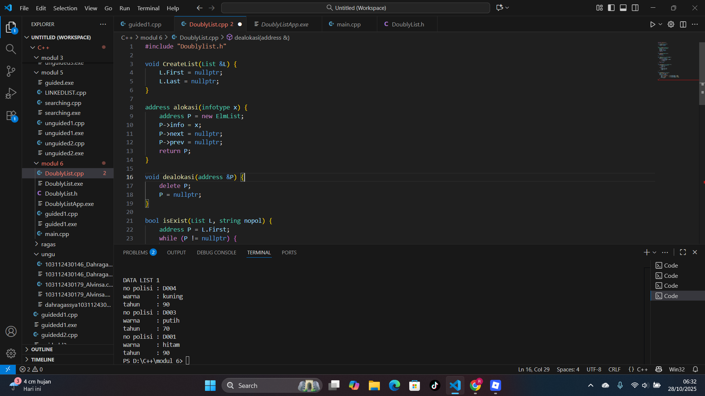
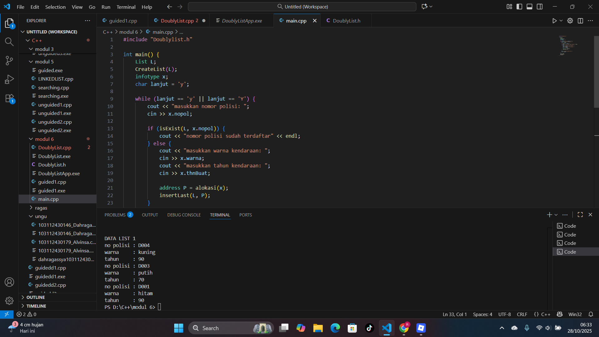

# <h1 align="center">Laporan Praktikum Modul 6 <br> Doubly Linked List (Bagian Pertama)</h1>
<p align="center">Dahragassya Safnas Adiyata - 103112430146</p>

## Dasar Teori

Doubly Linked List adalah tipe struktur data linear di mana setiap elemen, yang disebut node, tidak hanya menyimpan data tetapi juga memiliki dua bagian penunjuk, yaitu next dan previous. Bagian next menunjuk ke node berikutnya, sedangkan bagian previous menunjuk ke node sebelumnya. Dasar teorinya adalah meningkatkan efisiensi dalam melakukan beberapa operasi dibandingkan dengan Singly Linked List. Misalnya, kita bisa bergerak maju maupun mundur saat melintasi semua node, dan proses penghapusan node menjadi lebih cepat karena kita sudah memiliki penunjuk langsung ke node sebelumnya. Namun, keuntungan ini membutuhkan memori tambahan karena setiap node harus menyimpan dua penunjuk, dan proses penyisipan serta penghapusan node menjadi lebih rumit karena kita harus memperbarui kedua penunjuk, yaitu next dan previous, bukan hanya satu saja.
## Guide

```go
#include <iostream>
using namespace std;

struct Node {
    int data;
    Node* prev;
    Node* next;
};

Node* head = nullptr;
Node* tail = nullptr;

void insertDepan(int data) {
    Node* newNode = new Node();
    newNode->data = data;
    newNode->prev = nullptr;
    newNode->next = head;

    if (head != nullptr)
       head->prev = newNode;
    else
       tail = newNode;

    head = newNode;
    cout << "Data " << data << " berhasil ditambahkan di depan. \n";
}

void insertBelakang(int data) {
    Node* newNode = new Node();
    newNode->data = data;
    newNode->next = nullptr;
    newNode->prev = tail;

    if (tail != nullptr)
        tail->next = newNode;
    else
        head = newNode;

    tail = newNode;
    cout << "Data " << data << " berhasil ditambahkan di belakang.\n";
}

void insertSetelah(int target, int data) {
    Node* current = head;
    while (current != nullptr && current ->data != target)
        current = current->next;

    if(current == nullptr) {
        cout << "Data " << target << " tidak ditemukan.\n";
        return;
    }

    Node* newNode = new Node();
    newNode->data = data;
    newNode->next = current->next;
    newNode->prev = current;

    if (current->next != nullptr)
        current->next->prev = newNode;
    else
        tail = newNode;

    current->next = newNode;
    cout << "Data " << data << " berhasil disisipkan setelah " << target << ".\n";
}

void hapusDepan() {
    if (head == nullptr) {
        cout << "List kosong.\n";
        return;
    }

    Node* temp = head;
    head = head->next;

    if (head != nullptr)
        head->prev = nullptr;
    else
        tail = nullptr;

    cout << "Data " << temp->data << " dihapus dari depan.\n";
    delete temp;
}

void hapusBelakang() {
    if  (tail == nullptr) {
        cout << "List kosong.\n";
        return;
    }

    Node* temp = tail;
    tail = tail->prev;

    if (tail != nullptr)
        tail->next = nullptr;
    else
        head = nullptr;
    
    cout << "Data " << temp->data << " dihapus dari belakang.\n";
    delete temp;
}

void hapusData(int target) {
    Node* current = head;
    while (current != nullptr && current->data != target)
        current = current->next;

    if (current == nullptr) {
        cout << "Data " << target << " tidak ditemukan.\n";
        return;
    }

    if (current == head)
        hapusDepan();
    else if (current == tail)
        hapusBelakang();
    else {
        current->prev->next = current->next;
        current->next->prev = current->prev;
        cout << "Data " << target << " dihapus.\n";
        delete current;
    }
}
void updateData(int oldData, int newData) {
    Node* current = head;
    while (current != nullptr && current->data != oldData)
        current = current->next;

    if (current == nullptr) {
        cout << "Data " << oldData << " tidak ditemukan.\n";
        return;
    }

    current->data = newData;
    cout << "Data " << oldData << " diubah menjadi " << newData << ".\n";
}
void tampilDepan() {
    if (head == nullptr) {
        cout << "List kosong.\n";
        return;
    }

    cout << "Isi list (dari depan): ";
    Node* current = head;
    while (current != nullptr) {
        cout << current->data << " ";
        current = current->next;
    }
    cout << "\n";
}

// ====================================
// Fungsi: Tampilkan dari belakang
// ====================================
void tampilBelakang() {
    if (tail == nullptr) {
        cout << "List kosong.\n";
        return;
    }

    cout << "Isi list (dari belakang): ";
    Node* current = tail;
    while (current != nullptr) {
        cout << current->data << " ";
        current = current->prev;
    }
    cout << "\n";
}

// ====================================
// MAIN PROGRAM (MENU INTERAKTIF)
// ====================================
int main() {
    int pilihan, data, target, oldData, newData;

    do {
        cout << "\n===== MENU DOUBLE LINKED LIST =====\n";
        cout << "1. Insert Depan\n";
        cout << "2. Insert Belakang\n";
        cout << "3. Insert Setelah Data\n";
        cout << "4. Hapus Depan\n";
        cout << "5. Hapus Belakang\n";
        cout << "6. Hapus Data Tertentu\n";
        cout << "7. Update Data\n";
        cout << "8. Tampil dari Depan\n";
        cout << "9. Tampil dari Belakang\n";
        cout << "0. Keluar\n";
        cout << "===================================\n";
        cout << "Pilih menu: ";
        cin >> pilihan;

        switch (pilihan) {
            case 1:
                cout << "Masukkan data: ";
                cin >> data;
                insertDepan(data);
                break;
            case 2:
                cout << "Masukkan data: ";
                cin >> data;
                insertBelakang(data);
                break;
            case 3:
                cout << "Masukkan data target: ";
                cin >> target;
                cout << "Masukkan data baru: ";
                cin >> data;
                insertSetelah(target, data);
                break;
            case 4:
                hapusDepan();
                break;
            case 5:
                hapusBelakang();
                break;
            case 6:
                cout << "Masukkan data yang ingin dihapus: ";
                cin >> target;
                hapusData(target);
                break;
            case 7:
                cout << "Masukkan data lama: ";
                cin >> oldData;
                cout << "Masukkan data baru: ";
                cin >> newData;
                updateData(oldData, newData);
                break;
            case 8:
                tampilDepan();
                break;
            case 9:
                tampilBelakang();
                break;
            case 0:
                cout << "👋 Keluar dari program.\n";
                break;
            default:
                cout << "Pilihan tidak valid.\n";
        }

    } while (pilihan != 0);

    return 0;
}
```


## Unguide

### Soal 1
Buatlah ADT Doubly Linked list sebagai berikut di dalam file “Doublylist.h”:

```go
Type infotype : kendaraan <
    nopol : string
    warna : string
    thnBuat : integer
>
Type address : pointer to ElmList
Type ElmList <
    info : infotype
    next : address
    prev : address
>

Type List <
    First : address
    Last : address
>

procedure CreateList( input/output L : List )
function alokasi( x : infotype ) → address
procedure dealokasi(input/output P : address )
procedure printInfo( input L : List )
procedure insertLast(input/output L : List,  
   input P : address )
```
Buatlah implementasi ADT Doubly Linked list pada file “Doublylist.cpp” dan coba hasil implementasi ADT pada file “main.cpp”.

> Contoh Output:
``` Output
masukkan nomor polisi: D001
masukkan warna kendaraan: hitam
masukkan tahun kendaraan: 90
masukkan nomor polisi: D003
masukkan warna kendaraan: putih
masukkan tahun kendaraan: 70
masukkan nomor polisi: D001
masukkan warna kendaraan: merah
masukkan tahun kendaraan: 80
nomor polisi sudah terdaftar
masukkan nomor polisi: D004
masukkan warna kendaraan: kuning
masukkan tahun kendaraan: 90
DATA LIST 1
no polisi : D004
warna     : kuning
tahun     : 90
no polisi : D003
warna     : putih
tahun     : 70
no polisi : D001
warna     : hitam
tahun     : 90
```

## doublylist.h
```go
#ifndef DOUBLYLIST_H
#define DOUBLYLIST_H

#include <iostream>
#include <string>
using namespace std;

struct Kendaraan {
    string nopol;
    string warna;
    int thnBuat;
};
typedef Kendaraan infotype;

struct ElmList;
typedef ElmList* address;

struct ElmList {
    infotype info;
    address next;
    address prev;
};

struct List {
    address First;
    address Last;
};

void CreateList(List &L);
address alokasi(infotype x);
void dealokasi(address &P);
void insertLast(List &L, address P);
bool isExist(List L, string nopol);
void printInfo(const List &L);

#endif


```
> Output
> 


## doublylist.cpp
```go
#include "Doublylist.h"

void CreateList(List &L) {
    L.First = nullptr;
    L.Last = nullptr;
}

address alokasi(infotype x) {
    address P = new ElmList;
    P->info = x;
    P->next = nullptr;
    P->prev = nullptr;
    return P;
}

void dealokasi(address &P) {
    delete P;
    P = nullptr;
}

bool isExist(List L, string nopol) {
    address P = L.First;
    while (P != nullptr) {
        if (P->info.nopol == nopol)
            return true;
        P = P->next;
    }
    return false;
}

void insertLast(List &L, address P) {
    if (L.First == nullptr) {
        L.First = P;
        L.Last = P;
    } else {
        L.Last->next = P;
        P->prev = L.Last;
        L.Last = P;
    }
}

void printInfo(const List &L) {
    cout << "DATA LIST 1\n";
    address P = L.Last;
    while (P != nullptr) {
        cout << "no polisi : " << P->info.nopol << endl;
        cout << "warna     : " << P->info.warna << endl;
        cout << "tahun     : " << P->info.thnBuat << endl;
        P = P->prev;
    }
}
c
```
> Output
> 


## main.cpp
```go
#include "Doublylist.h"

int main() {
    List L;
    CreateList(L);
    infotype x;
    char lanjut = 'y';

    while (lanjut == 'y' || lanjut == 'Y') {
        cout << "masukkan nomor polisi: ";
        cin >> x.nopol;

        if (isExist(L, x.nopol)) {
            cout << "nomor polisi sudah terdaftar" << endl;
        } else {
            cout << "masukkan warna kendaraan: ";
            cin >> x.warna;
            cout << "masukkan tahun kendaraan: ";
            cin >> x.thnBuat;

            address P = alokasi(x);
            insertLast(L, P);
        }

        cout << "Tambah data lagi? (y/n): ";
        cin >> lanjut;
    }

    cout << endl;
    printInfo(L);
    return 0;
}

```

> Output
> 

> Hasil
> 

Program di atas merupakan implementasi ADT Doubly Linked List untuk menyimpan data kendaraan yang terdiri dari nomor polisi, warna, dan tahun pembuatan. Struktur data ini menggunakan pointer ganda (next dan prev) agar data dapat diakses dari depan maupun belakang. Pada fungsi utama (main), pengguna diminta memasukkan data kendaraan satu per satu, dan sistem akan memeriksa apakah nomor polisi sudah terdaftar menggunakan fungsi isExist. Jika belum ada, data baru dialokasikan dengan alokasi dan dimasukkan ke bagian akhir list menggunakan insertLast. Setelah proses input selesai, fungsi printInfo menampilkan seluruh isi list mulai dari elemen terakhir hingga pertama, sehingga urutan tampilannya terbalik dari urutan input. Program ini menggambarkan cara kerja dasar list ganda dengan pengecekan duplikasi dan traversal dua arah secara dinamis.

## Referensi
1. https://www.w3schools.com/dsa/dsa_theory_linkedlists.php
2. https://www.w3schools.com/dsa/dsa_data_linkedlists_types.php
3. https://www.w3schools.com/dsa/dsa_algo_linkedlists_operations.php
4. https://www.w3schools.com/dsa/dsa_theory_linkedlists_memory.php
5. https://www.w3schools.com/dsa/dsa_examples.php
