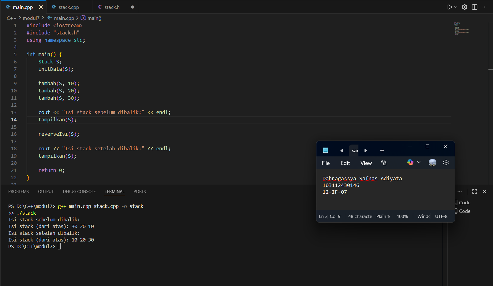

# <h1 align="center">Laporan Praktikum Modul 7 <br> Stack</h1>
<p align="center">Dahragassya Safnas Adiyata - 103112430146</p>

## Dasar Teori
Stack adalah struktur data linear yang fundamental yang bekerja berdasarkan prinsip LIFO (Last In, First Out), di mana elemen yang baru dimasukkan akan menjadi elemen pertama yang diambil. Struktur ini dapat diimplementasikan menggunakan array (dengan kapasitas tetap dan akses cepat) atau pointer, dan menggunakan penunjuk tunggal TOP untuk melacak elemen teratas. Operasi intinya mencakup push (menambah data), pop (menghapus data teratas), dan printInfo (menampilkan isi), serta dilengkapi operasi lanjutan seperti balikStack atau pushAscending untuk mempertahankan keterurutan.
## Guide

```go
#include <iostream>
using namespace std;

struct Node
{
    int data;
    Node *next;
};

bool isEmpety(Node *top)
{
    return top == nullptr;
}

void push(Node *&top, int data){
    Node *newNode = new Node;
    newNode -> data = data;
    newNode -> next = top;
    top = newNode;
}

int pop(Node *&top)
{
    if (isEmpety(top))
    {
        cout << "Stack Kosong, tidak bisa pop!" << endl;
        return 0;
    }

    int poppedData = top -> data;
    top = top -> next;

    Node *temp;
    return poppedData;
}

void show (Node *top)
{
    if (isEmpety(top))
    {
        cout << "Stack kosong," << endl;
        return;
    }
    cout << "TOP -> ";
    Node *temp = top;

    while (temp != nullptr)
    {
        cout << temp->data << "-> ";
        temp = temp->next;
    }

    cout << "NULL" << endl;

}

int main()
{
    Node *stack = nullptr;

    push(stack, 10);
    push(stack, 20);
    push(stack, 30);

    cout << "Menampilkan isi stack:" << endl;
    show (stack);

    cout << "pop;" << pop(stack) << endl;

    cout << "Menampilkan sisa Stack:" << endl;
    show(stack);

    return 0;
}
```


## Unguide

### Soal 1

### stack.h
```go
#ifndef STACK_H
#define STACK_H

#define MAX 100
typedef int infotype;

struct Stack {
    infotype info[MAX];
    int top;
};

void initData(Stack &T);
bool kosong(Stack T);
bool penuh(Stack T);
void tambah(Stack &T, infotype nilai);
infotype ambil(Stack &T);
void tampilkan(Stack T);
void reverseIsi(Stack &T);

#endif


```

### stack.cpp
```go
#include <iostream>
#include "stack.h"
using namespace std;

void initData(Stack &T) {
    T.top = -1;
}

bool kosong(Stack T) {
    return T.top == -1;
}

bool penuh(Stack T) {
    return T.top == MAX - 1;
}

void tambah(Stack &T, infotype nilai) {
    if (!penuh(T)) {
        T.top++;
        T.info[T.top] = nilai;
    } else {
        cout << "Maaf, stack sudah penuh!" << endl;
    }
}

infotype ambil(Stack &T) {
    if (!kosong(T)) {
        infotype nilai = T.info[T.top];
        T.top--;
        return nilai;
    } else {
        cout << "Tidak bisa mengambil, stack kosong!" << endl;
        return -1;
    }
}

void tampilkan(Stack T) {
    if (kosong(T)) {
        cout << "Stack saat ini kosong." << endl;
        return;
    }

    cout << "Isi stack (dari atas): ";
    for (int i = T.top; i >= 0; i--) {
        cout << T.info[i] << " ";
    }
    cout << endl;
}

void reverseIsi(Stack &T) {
    Stack bantu;
    initData(bantu);

    while (!kosong(T)) {
        tambah(bantu, ambil(T));
    }

    T = bantu;
}


```

### main.cpp
```go
#include <iostream>
#include "stack.h"
using namespace std;

int main() {
    Stack S;
    initData(S);

    tambah(S, 10);
    tambah(S, 20);
    tambah(S, 30);

    cout << "Isi stack sebelum dibalik:" << endl;
    tampilkan(S);

    reverseIsi(S);

    cout << "Isi stack setelah dibalik:" << endl;
    tampilkan(S);

    return 0;
}


```

> Output
> 

Program ini membangun struktur data stack yang bekerja dengan prinsip LIFO (Last In First Out), yaitu elemen yang dimasukkan terakhir akan dikeluarkan terlebih dahulu. Struktur stack disimpan menggunakan array dengan variabel top sebagai penanda posisi elemen teratas. Program ini dilengkapi dengan beberapa fungsi utama, antara lain push untuk menambahkan data ke dalam stack, pop untuk menghapus data dari bagian atas stack, printInfo untuk menampilkan seluruh isi stack, dan balikStack untuk membalik urutan data di dalamnya. Pada bagian fungsi main, program melakukan proses penambahan dan penghapusan beberapa elemen, kemudian menampilkan isi stack baik sebelum maupun sesudah proses pembalikan dilakukan.

### Soal 2

### stack.h
```go
#ifndef STACK_H
#define STACK_H

#define MAX 20
typedef int DataType;

struct Stack {
    DataType data[MAX];
    int top;
};

void initStack(Stack &S);

void push(Stack &S, DataType value);
DataType pop(Stack &S);
void showStack(Stack S);
void reverseStack(Stack &S);

void pushAscending(Stack &S, DataType value);

#endif

```

### stack.cpp
```go
#include <iostream>
#include "stack.h"
using namespace std;

void initStack(Stack &S) {
    S.top = -1;
}

void push(Stack &S, DataType value) {
    if (S.top == MAX - 1) {
        cout << "Stack penuh!" << endl;
    } else {
        S.top++;
        S.data[S.top] = value;
    }
}

DataType pop(Stack &S) {
    if (S.top == -1) {
        cout << "Stack kosong!" << endl;
        return -1;
    } else {
        DataType temp = S.data[S.top];
        S.top--;
        return temp;
    }
}

void showStack(Stack S) {
    cout << "[TOP] ";
    for (int i = S.top; i >= 0; i--) {
        cout << S.data[i] << " ";
    }
    cout << endl;
}

void reverseStack(Stack &S) {
    Stack temp;
    initStack(temp);

    while (S.top != -1) {
        push(temp, pop(S));
    }

    S = temp;
}

void pushAscending(Stack &S, DataType value) {
    Stack temp;
    initStack(temp);

    while (S.top != -1 && S.data[S.top] > value) {
        push(temp, pop(S));
    }

    push(S, value);

    while (temp.top != -1) {
        push(S, pop(temp));
    }
}

```

### main.cpp
```go
#include <iostream>
#include "stack.h"
using namespace std;

int main() {
    Stack S;
    initStack(S);

    pushAscending(S, 3);
    pushAscending(S, 4);
    pushAscending(S, 8);
    pushAscending(S, 2);
    pushAscending(S, 3);
    pushAscending(S, 9);

    cout << "Isi stack sebelum dibalik:" << endl;
    showStack(S);

    cout << "Isi stack setelah dibalik:" << endl;
    reverseStack(S);
    showStack(S);

    return 0;
}

```

> Output
> 

Program ini digunakan untuk membangun dan mengelola struktur data Stack menggunakan array dengan konsep LIFO (Last In First Out), yaitu elemen yang terakhir dimasukkan akan dikeluarkan terlebih dahulu. Pada file stack.h, didefinisikan struktur Stack yang memiliki array data untuk menyimpan elemen dan variabel top sebagai penanda posisi elemen teratas. File ini juga berisi deklarasi fungsi-fungsi penting seperti initStack, push, pop, showStack, reverseStack, dan pushAscending. Implementasi dari fungsi-fungsi tersebut terdapat pada file stack.cpp, di mana initStack berfungsi untuk menginisialisasi stack agar kosong, push menambahkan elemen baru ke bagian atas stack, pop menghapus elemen teratas, showStack menampilkan isi stack dari atas ke bawah, reverseStack membalik urutan elemen dalam stack dengan memanfaatkan stack sementara, dan pushAscending digunakan untuk menambahkan elemen baru sambil menjaga agar data tetap tersusun secara menaik. Pada file main.cpp, fungsi-fungsi tersebut dimanfaatkan untuk membuat stack, menambahkan data secara berurutan naik, menampilkan isi stack, kemudian membalik urutan datanya dan menampilkan hasilnya kembali.

### Soal 3

### stack.h
```go
#include <iostream>
#include "stack.h"
using namespace std;

int main() {
    Stack S;
    initStack(S);

    pushAscending(S, 3);
    pushAscending(S, 4);
    pushAscending(S, 8);
    pushAscending(S, 2);
    pushAscending(S, 3);
    pushAscending(S, 9);

    cout << "Isi stack sebelum dibalik:" << endl;
    showStack(S);

    cout << "Isi stack setelah dibalik:" << endl;
    reverseStack(S);
    showStack(S);

    return 0;
}

#endif  
```

### stack.cpp
```go
#include <iostream>
#include "stack.h"
using namespace std;

void initStack(Stack &S) {
    S.top = -1;
}

void push(Stack &S, DataType value) {
    if (S.top == MAX - 1) {
        cout << "Stack penuh!" << endl;
    } else {
        S.top++;
        S.data[S.top] = value;
    }
}

DataType pop(Stack &S) {
    if (S.top == -1) {
        cout << "Stack kosong!" << endl;
        return -1;
    } else {
        DataType temp = S.data[S.top];
        S.top--;
        return temp;
    }
}

void showStack(Stack S) {
    cout << "[TOP] ";
    for (int i = S.top; i >= 0; i--) {
        cout << S.data[i] << " ";
    }
    cout << endl;
}

void reverseStack(Stack &S) {
    Stack temp;
    initStack(temp);

    while (S.top >= 0) {
        push(temp, pop(S));
    }

    S = temp;
}

void readInput(Stack &S) {
    cout << "Masukkan angka (akhiri dengan ENTER): ";

    char inputChar;
    cin.get(inputChar);

    while (inputChar != '\n') {
        if (isdigit(inputChar)) {  // cek apakah karakter angka
            push(S, inputChar - '0');
        }
        cin.get(inputChar);
    }
}


```

### main.cpp
```go
#include <iostream>
#include "stack.h"
using namespace std;

int main() {
    cout << "Program Stack Input" << endl;

    Stack S;
    initStack(S);

    readInput(S);
    cout << "Isi stack saat ini:" << endl;
    showStack(S);

    cout << "Setelah dibalik:" << endl;
    reverseStack(S);
    showStack(S);

    return 0;
}


```

> Output
> 

Program ini membangun struktur data stack yang bekerja berdasarkan prinsip LIFO (Last In First Out), di mana elemen yang dimasukkan terakhir akan dikeluarkan terlebih dahulu. File stack.h berisi definisi struktur stack serta deklarasi fungsi-fungsi yang digunakan untuk operasinya. Implementasi logika program terdapat pada stack.cpp, yang mencakup proses pembuatan stack, penambahan data dengan fungsi push, penghapusan data menggunakan pop, penampilan isi stack melalui printInfo, pembalikan urutan data dengan balikStack, serta pembacaan input dari pengguna melalui getInputStream. Pada bagian main.cpp, program menginisialisasi stack, menerima input angka dari pengguna, menampilkan isi stack, kemudian membalik urutan elemen di dalamnya dan menampilkan hasil akhirnya.

## Referensi
1. https://www.w3schools.com/cpp/cpp_functions.asp
2. https://www.w3schools.com/cpp/cpp_arrays.asp
3. https://www.w3schools.com/cpp/cpp_user_input.asp
4. https://www.w3schools.com/cpp/cpp_while_loop.asp
5. https://www.w3schools.com/cpp/cpp_stacks.asp

